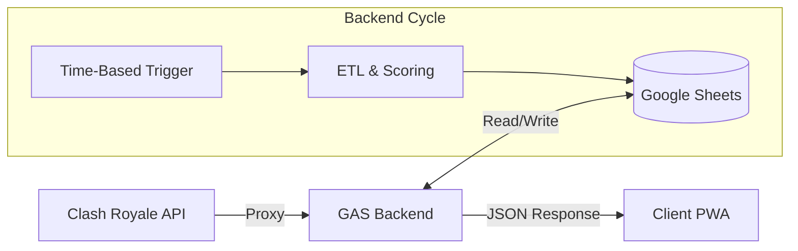

# Clash Manager Server (GAS)

<!-- Static badges for the backend as GAS doesn't have a package.json -->


[](https://github.com/albidr/Clash-Manager/blob/Stable/LICENSE)

**Clash Manager Server** is the backend engine powered by Google Apps Script. It acts as the API Gateway, ETL Pipeline, and Database (via Google Sheets) for the Clash Manager ecosystem.

Instead of serving HTML directly (standard GAS Web App), it operates as a **Headless API**, serving compressed JSON to the PWA frontend.

---

## 🏗️ Architecture



### Core Concepts
1.  **Cycle-Based Execution**: The system updates data on a schedule (Time-based triggers) or on-demand, rather than on every request.
2.  **Mutex Locking**: Uses `LockService` to prevents race conditions. If an update is running, subsequent requests wait or abort safely to prevent database corruption.
3.  **Key Rotation**: Rotates through a pool of API keys to respect Clash Royale API rate limits during heavy scanning operations.

---

## 🧩 Module Ecosystem

| File | Responsibility |
| :--- | :--- |
| **`API_Public`** | **Router**: Handles `doGet`/`doPost` and standardized JSON responses. |
| **`Controller_Webapp`** | **Data Layer**: Generates, compresses, and caches the frontend payload. |
| **`Recruiter`** | **Intelligence**: Runs the "Deep Net" tournament scan to find recruits. |
| **`Leaderboard`** | **Ranking**: Aggregates member stats and calculates war history. |
| **`Logger`** | **Database**: Handles daily snapshots and historical pruning. |
| **`ScoringSystem`** | **Math**: Isolated algorithms for player scoring (Protected Logic). |
| **`Orchestrator & Triggers`** | **Control**: Manages triggers, menus, and update sequences. |
| **`Utilities`** | **Core**: Fetching, backups, and shared helpers. |
| **`Configuration`** | **Config**: Central constants, schema definitions, and API keys. |

---

## 🧠 Scoring System — Heuristics & Formula
The `ScoringSystem` is intentionally isolated from I/O and contains the canonical logic used to compute both a player's **Raw Score** and the **Performance Score** (after decay). Key implementation files:

- `Backend-GAS/ScoringSystem.gs.js` — algorithm: `computeScores()` and `calculateWarRate()`.
- `Backend-GAS/Configuration.gs.js` — weights and penalties (single source of truth).

Canonical (LaTeX) formula used across the system:

$$
\text{Performance Score} = \left[ (\text{Current Fame} \times 3) + (\text{Avg Fame} \times 15) + (\text{Donations} \times 50) + (\text{Trophies} \times 0.0002) + (\text{War Rate} \times 150) \right] \\
\times \left(0.92^{\max(0, \text{Days Inactive} - 4)}\right)
$$

Produced values reflect both **impact** (fame), **stability** (avg fame), **contribution** (donations), **reliability** (war rate), and a tiny popularity signal (trophies). The numeric parameters are defined in `CONFIG.LEADERBOARD`:

- `WEIGHTS: { FAME: 3, AVG_FAME: 15, DONATION: 50, TROPHY: 0.0002, WAR_RATE: 150 }`
- `PENALTIES: { INACTIVITY_GRACE_DAYS: 4, DECAY_RATE: 0.08 }`

Design rationale:

- **War Rate (×150)** is intentionally large because it operates on a 0–100 scale and captures reliability; this ensures consistent participants rank highly even when short-term metrics fluctuate.
- **Donations (×50)** incentivize clan-support behaviors; a high donations weight ensures community-first players are visible.
- **Avg Fame (×15) vs Current Fame (×3)** balances stability and recency: average reduces noise, current captures bursts.
- **Trophy (×0.0002)** is normalized to avoid overwhelming the score (trophies are large absolute numbers).

Tuning guidance:
- Adjust `CONFIG.LEADERBOARD.WEIGHTS` to emphasize or de-emphasize signals; run a validation snapshot (compare `raw` vs `perf`) to verify intended effects.
- Modify `PENALTIES.DECAY_RATE` and `INACTIVITY_GRACE_DAYS` to control how quickly inactive players are deprioritized.

For the exact computation flow, refer to `ScoringSystem.computeScores()` (raw score + decay) and `Leaderboard` which normalizes to a 0–100 `Performance Score` for display.

## 🚀 Setup Guide

<details>
<summary><strong>Click to view Deployment Instructions</strong></summary>

### 1. Installation
1.  Create a new **Google Sheet**.
2.  Navigate to **Extensions > Apps Script**.
3.  Copy the content of the `.gs.js` files into the editor (rename them to `.gs`).

### 2. Configuration
Open **Project Settings > Script Properties** and add the following keys:

| Property | Value |
| :--- | :--- |
| `ClanTag` | Your Clan Tag (e.g., `#29Uqq282`) |
| `CRK1` ... `CRK10` | Clash Royale Developer API Keys |
| `WebAppUrl` | (Optional) URL of the deployed PWA |

### 3. Deployment
1.  Click **Deploy > New Deployment**.
2.  Select type: **Web App**.
3.  Execute as: **Me** (The owner).
4.  Who has access: **Anyone** (Required for the PWA to fetch data via AJAX).

### 4. Initialization
1.  Refresh the Google Sheet.
2.  Locate the custom menu **👑 Clan Manager**.
3.  Run **"🛡️ Health Check"** to verify modules.
4.  Run **"🚀 Run Master Sequence"** to hydrate the database.
</details>

---

## 🔌 API Protocol

The backend exposes a single HTTP endpoint.

### Standard Envelope
```json
{
  "status": "success",
  "data": { ... },
  "error": null,
  "timestamp": "ISO_DATE_STRING"
}
```

### Endpoints
*   `GET ?action=getwebappdata`: Returns the monolithic, compressed data payload (Leaderboard + Recruits).
*   `GET ?action=ping`: System health check (returns version and status).
*   `POST`: Accepts JSON body `{ "action": "dismissRecruits", "ids": [...] }` to update the blacklist.

---

## 📄 License

Proprietary.
Copyright © 2026 AlbiDR.
