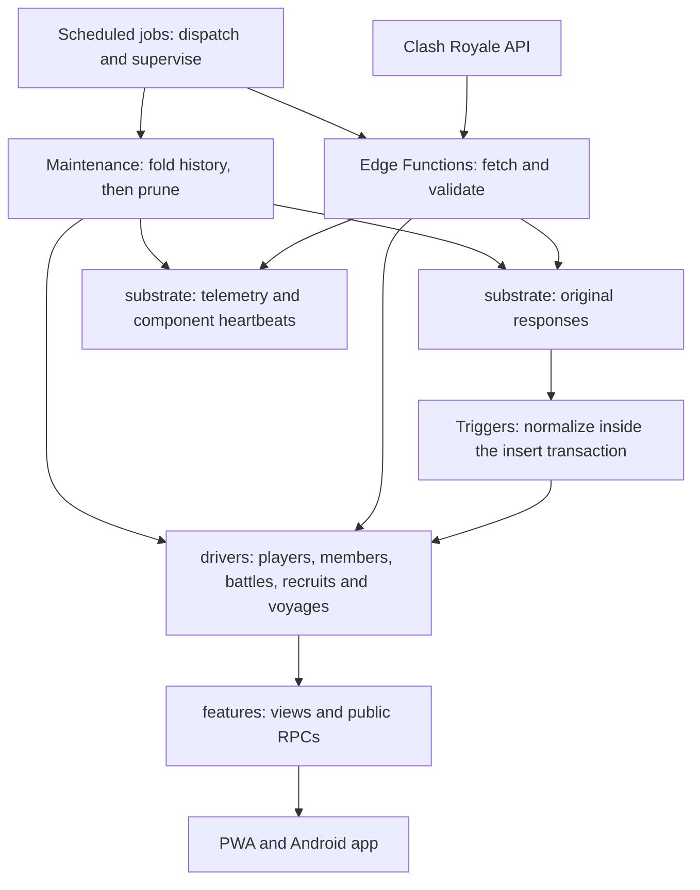

<!-- SPDX-License-Identifier: GPL-3.0-only -->
<!-- Copyright (C) 2026 AlbiDR -->

# Understanding and auditing the database

The database is part of the codebase. Its tables, functions, triggers, views and
permissions are defined under `supabase/migrations/`; its fetching code lives
under `supabase/functions/`. Supabase hosts the running instance. Understanding
that instance requires both the source and measurements of what is actually
running. A clean schema alone cannot prove that ingestion finishes or that the
app can read its data.

Start with `pnpm db:audit --output /path/report`. Open the generated `.html` file
to explore the database without writing SQL. The report describes every
application table, its storage, columns, lifecycle, indexes, triggers, dependent
views and routines that mention it. It also lists scheduled jobs, recorded query
costs and migration source locations. Nothing is changed in the database.

The first measured findings and ordered work list are recorded in
[the October 5 architecture audit](database-audit-2026-10-05.md).

## The data path



The schema names are folders inside PostgreSQL:

| Schema | Purpose | Example |
| --- | --- | --- |
| `substrate` | Original API responses, configuration and pipeline control | `raw_war_log`, `pipeline_heartbeat` |
| `drivers` | Shared domain entities and useful history | `players`, `members`, `player_battles` |
| `features` | App-facing projections, actions and the card snapshot cache | `roster_view`, `headhunter_view` |
| `public` | RPC bridge used by Edge Functions and some app requests | `ingest_player_battles`, `report_heartbeat` |

Platform schemas such as `auth`, `storage`, `cron`, `net` and `vault` belong to
Supabase or database extensions. The report aggregates their storage separately
without exporting their contents.

## What costs resources

A **table** stores records. An **index** is an additional lookup structure that
can make reads fast, but every insert or update may also update that structure.
An index can serve a uniqueness constraint as well as queries. Removing it can
break correctness even if its recent scan counter is zero.

A **view** runs its underlying query when requested. A small JSON response can
require large joins and aggregations. A **routine**, sometimes exposed as an
RPC, runs database code; even `SELECT routine()` can write data. A **trigger**
runs automatically when rows change, so inserting one raw response may update
many domain records and fire more triggers in the same transaction.

Large JSON values use overflow storage called **TOAST**. Replacing a large
telemetry JSON document at every stage creates more work than replacing a small
progress summary. Retention limits how old records become; it does not limit
payload size, write frequency or physical space awaiting reuse.

Useful history needs an explicit purpose. Raw responses can be short-lived;
daily summaries preserve useful totals with fewer records. Invitations and
dismissals may deserve longer retention than routine scan events. A table
growing over time is not by itself a defect. Compare snapshots and relate growth
to actual ingestion, retention and product needs.

## Repeatable inspection

Run from the repository root with `SUPABASE_ACCESS_TOKEN` available and the
backend linked to its intended project. Never paste the token into a report.

```bash
# Current connection, real app reads, ingestion freshness and host evidence
pnpm db:health

# Preserve a resource sample, then compare it with a later capture
pnpm --silent db:health --json > /tmp/db-health-before.json
pnpm db:health --compare /tmp/db-health-before.json

# Compare two existing reports without contacting Supabase
pnpm db:health --compare /tmp/db-health-before.json /tmp/db-health-after.json

# Read-only inventory, aggregate counts and a standalone interactive report
pnpm db:audit --output /absolute/path/first

# Later: measured storage differences, with activity resets accounted for
pnpm db:audit --compare /absolute/path/first.snapshot.json --output /absolute/path/later

# Inspect a saved snapshot without contacting Supabase
pnpm db:audit --snapshot /absolute/path/first.snapshot.json --output /absolute/path/offline

# Pure machine-readable output
pnpm --silent db:audit --json

# Existing authoritative checks
pnpm audit:cron
pnpm audit:migrations
pnpm audit:db-drift --live
```

Health comparisons report disk-wait CPU time and swap pages per second over the
resource acquisition interval. They use the midpoint between each request's
start and completion and include timing bounds; the exporter's sample age is
unknown. Continuity uses the host boot metric when available, or the exported
PostgreSQL process start time when the provider omits it. The report names that
identity source. A restart, changed CPU series, counter reset or missing evidence prevents
the affected rate from being reported as usable. Old reports without these
fields remain readable but cannot establish interval pressure. The command
exits with code 1 for an unavailable or degraded requested comparison, even
when the latest app reads succeed. Keep reports private and capture a complete
ingestion or maintenance interval when investigating a recurring slowdown.

`db:audit` writes `.snapshot.json` (database evidence), `.json` (interpreted
report) and `.html` (interactive atlas). It has no external assets or network
requests when opened. Generated files use owner-only permissions. Keep them
private: metadata still describes application structure. Row payloads, player
identities, subscriptions, function bodies, raw queries, cron commands and
credentials are excluded by the capture SQL. Do not run this collector on every
frontend sync: it deliberately counts selected tables and inspects catalogs.

`Backend/database-map.json` is the purpose and lifecycle dictionary. Runtime
retention values remain authoritative in `substrate.config`; the dictionary
names the policy instead of copying its numbers. New tables appear in the
report as undocumented, and the command exits unsuccessfully until their
purpose is recorded. The audit uses the existing migration parser to find
definitions across all local migration files. Those locations help navigation;
they do not prove that a sequence of migrations reconstructs the live schema.

The existing `audit:db-drift` compares the **master baseline**, not a replay of
all incremental migrations. Its live-only findings can therefore include
objects declared in later migrations. Resolve that scope before interpreting
the result as evidence that an object was never committed. Full recovery
equivalence requires a disposable rebuild and comparison of definitions,
constraints, permissions and configuration, not merely matching object names.

## Interpreting an outage

These are separate observations:

1. The management API can execute SQL.
2. PostgREST can return the full roster and recruit results as the app's role.
3. Cron dispatched the ingestion function.
4. The Edge Function completed and persisted data.
5. The data is fresh enough for the product.

`db:health` covers current connectivity and freshness alongside recent cron
history. `db:audit` covers structure, storage and recorded successful query
costs. Failed and cancelled queries need Postgres/PostgREST/Edge Function logs;
they are not reliably represented in successful execution statistics. See
[PostgreSQL's statement statistics documentation](https://www.postgresql.org/docs/17/pgstatstatements.html).

For resource diagnosis, compare host metric samples over the same incident
interval. Lifetime swap and disk-wait totals are not the current rate, and high
swap usage alone is not proof of active memory pressure. Table row estimates
and index usage counters can lag or reset. The atlas labels counted rows and
estimates separately and suppresses activity deltas across detected resets.

The report exposes its coverage limits. Execution plans, endpoint authorization
tests and recovery rehearsals must remain visible as unfinished until actually
performed. Supabase advisors are a separate source of review items; findings
about owner-privileged views or missing policies must be interpreted against the
intended public API and deny-by-default internal tables.

## Changing the architecture

Take a before measurement. Define the behavior and data that must be preserved.
Create a tracked migration before applying SQL changes, following the ADR.
Check query plans and workload costs, exercise late arrivals and retries, and
measure again under comparable load. Regenerate database types after structural
changes. Record completion evidence in the audit work list.

For a history fold, correctness includes duplicate ingestion, late arrivals,
partially purged dates, retry after failure and concurrent ingestion. For a
public RPC, correctness includes the intended publishable-role access and
forbidden operations. For a maintenance job, correctness includes a durable
failure signal even when its database transaction rolls back.
