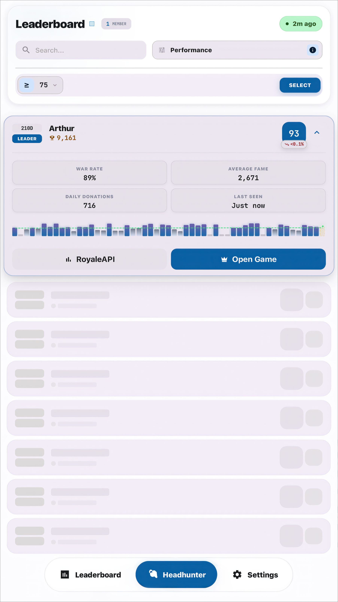
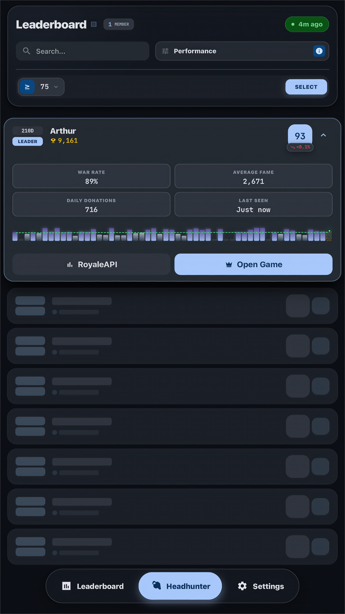
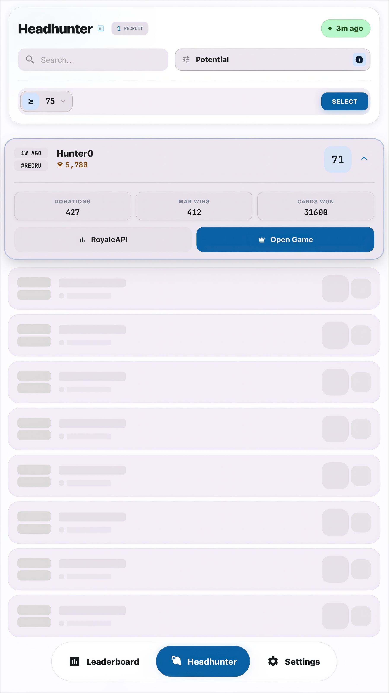
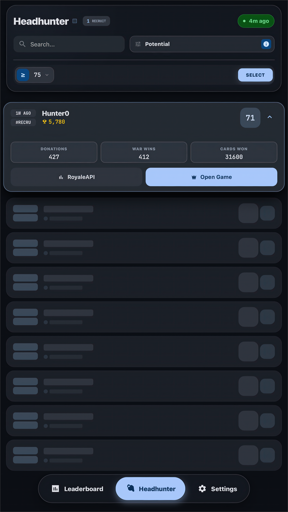

# Clash Manager — Client Core (PWA)

[](https://github.com/albidr/Clash-Manager) [](../docs/ARCHITECTURE.md) [](../LICENSE)

The **Operational Command Center**. A high-performance, offline-first Vue 3 application that serves as the primary interface for clan management.

---

## Visual Experience

<div align="center">
  <table>
    <tr>
      <td align="center" width="50%">
        <strong>Roster View</strong><br />
        
      </td>
      <td align="center" width="50%">
        <strong>Roster (Dark)</strong><br />
        
      </td>
    </tr>
    <tr>
      <td align="center" width="50%">
        <strong>Headhunter View</strong><br />
        
      </td>
      <td align="center" width="50%">
        <strong>Headhunter (Dark)</strong><br />
        
      </td>
    </tr>
  </table>
</div>

---

## Sovereign Design System

The application has migrated away from utility frameworks to a custom, highly-optimized **Vanilla CSS** architecture (`style.css`).

- **Theme Engine**: Real-time HSL variable injection for seamless Light/Dark mode transitions.
- **Glassmorphism**: Hardware-accelerated blurs and translucency effects.
- **Fluid Topology**: Layouts that adapt continuously from mobile viewports to ultra-wide desktop dashboards.
- **Micro-Interactions**: Haptic feedback patterns (vibration) synchronized with visual cues.

---

## Technical Stack

| Layer | Technology | Description |
| :--- | :--- | :--- |
| **Core** | **Vue 3** | Composition API (`<script setup>`) for maximum type inference. |
| **Language** | **TypeScript** | Strict mode enabled for 100% type safety. |
| **State** | **Composables** | Decentralized, atomic state management (No Pinia/Vuex overhead). |
| **Network** | **GasClient** | Specialized bridge for communicating with Google Apps Script. |
| **Schema** | **Valibot** | Runtime payload validation to ensure data integrity. |
| **PWA** | **Vite PWA** | Service Worker registration, asset caching, and offline support. |
| **Testing** | **Vitest** | Unit and component testing with JSDOM environment. |

---

## Project Structure

The codebase follows a functional "Domain-Driven" organization within `src/composables` while keeping UI components atomic.

```text
src/
├── api/             # gasClient.ts (The HEADLESS Bridge)
├── components/      # Atomic UI elements (Buttons, Cards, Inputs)
├── composables/     # The "Brain" - All business logic lives here
│   ├── useClashData.ts    # Main data hydration
│   ├── useHeadhunter.ts   # Recruitment logic
│   └── useTheme.ts        # Design system controller
├── views/           # Page-level orchestration (Router targets)
├── style.css        # The Sovereign Design System (Global Variables)
└── sw.ts            # Service Worker logic (Offline caching)
```

---

## Development

### Prerequisites
- Node.js `v20+`
- pnpm `v9+`

### Quick Start

```bash
# Install dependencies
pnpm install

# Start local development server (Hot Module Replacement)
pnpm dev
# > Available at http://localhost:5173
```

### Environment Setup
Create a `.env` file in the root directory to link to your backend:

```ini
# URL of your Google Apps Script Web App execution
VITE_GAS_URL=https://script.google.com/macros/s/.../exec
```

---

## Quality Assurance

The project adheres to strict testing standards to prevent regression in critical clan operations.

```bash
pnpm test          # Run unit logic tests
pnpm test:ui       # Open the Vitest UI dashboard
pnpm type-check    # Verify TypeScript types
```

---

## Mobile-First Features

- **Installable**: Meets all PWA criteria for installation on iOS and Android.
- **Offline Capable**: Views cache automatically (`Stale-While-Revalidate` strategy).
- **Haptics**: Uses `navigator.vibrate` for tactile feedback on interactions.
- **Deep Linking**: Supports URL routing for sharing specific clan profiles or searches.

---

## License

**GNU GPL v3**.
Copyright (c) 2026 AlbiDR.
This project is free software and available under the [GPL v3 License](../LICENSE).
