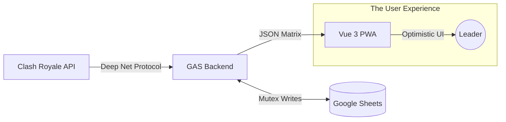

# Clash Manager: Clan Manager for Clash Royale

-FFD700?style=flat-square&logo=clashroyale&logoColor=white)

[](https://github.com/albidr/Clash-Manager/blob/main/LICENSE)

**Clash Manager** is a sophisticated clan management suite for Clash Royale. It bridges the gap between raw data analysis and modern user experience by combining a **Headless Google Apps Script Backend** with a **Progressive Web App (PWA)** frontend.

It is designed for leaders who want the power of a database (Google Sheets) but the speed and aesthetics of a native mobile application.

---

## 🏗️ System Architecture

Clash Manager operates on a hybrid "Serverless" architecture where Google Sheets acts as the database and the Client handles all presentation logic.



### 🧠 The Backend (Server)
Located in [`/backend`](./backend), this is the intelligence engine.
*   **Cycle-Based Intelligence**: Runs scheduled ETL jobs to build history graphs and calculate scores.
*   **Safety First**: Implements **Mutex Locking** to prevent race conditions and **Key Rotation** to respect API limits.
*   **Headless API**: Serves compressed JSON matrices via a `doGet` REST endpoint.

### 🎨 The Frontend (Client)
Located in [`/frontend`](./frontend), this is the visual layer.
*   **Neo-Material Design**: A custom design system featuring glassmorphism, tonal palettes, and fluid spring physics.
*   **Offline-First**: Uses a Stale-While-Revalidate (SWR) strategy. The app loads instantly from cache while syncing in the background.

---

## 🔥 Power Tools & Core Logic

Clash Manager offers features that go far beyond standard stat tracking sites.

### ⚡ Batch Command Console
Managing a clan often requires checking dozens of profiles.
*   **Mass-Open Profiles**: Select multiple players (Recruits or Members) and open their in-game profiles sequentially.
*   **Throttled Queue**: The app uses a smart `BatchQueue` system that throttles deep links (`clashroyale://`) to prevent the operating system from blocking pop-ups or crashing the game client.
*   **Bulk Dismissal**: Instantly remove batches of rejected recruits from the view with Optimistic UI updates (instant visual removal, background sync).

### 📐 Complex Member Scoring Engine
We don't just count crowns. The backend runs a proprietary `ScoringSystem` module to determine the "True Value" of a player.
*   **Hybrid War Logic**:
    *   **Grace Period**: 0 Fame on Training Days (Mon-Wed) is ignored.
    *   **Strict Mode**: 0 Fame on Battle Days (Thu-Sun) drastically penalizes the score.
*   **Inactivity Decay**: Scores decay exponentially (`0.92^Days`) if a player hasn't been seen in >4 days, bubbling active players to the top.
*   **Sticky Memory**: The database remembers a player's War History for 52 weeks, ensuring one bad week doesn't ruin a veteran's rank.

### 🔭 The Headhunter (Recruiter)
A tool to find specific talent in a sea of millions of players.
*   **Deep Net Protocol**: Broadcasts parallel search requests for every alphanumeric character (`0-9`, `a-z`) to find hidden tournaments.
*   **Stochastic Prioritization**: Randomizes the search targets within the top 800 tournaments every cycle to ensure fresh results.
*   **Density Filter**: Automatically discards empty or "dead" tournaments after analyzing their population density.

---

## 🚀 Getting Started

This repository is a monorepo containing both the client and server code. You will need to deploy them sequentially.

### 1. Deploy the Backend
The backend runs on Google Apps Script. You don't need a server; just a Google Sheet.
*   [**Backend Setup Guide**](./backend/README(GAS).md)

### 2. Deploy the Frontend
The frontend is a static Vue 3 app that can be hosted on GitHub Pages, Vercel, or Netlify.
*   [**Client Setup Guide**](./frontend/README(PWA).md)

---

## 📂 Project Structure

```text
Clash-Manager/
├── backend/           # Google Apps Script code (.gs.js)
│   ├── Controller     # Data Layer & Compression
│   ├── Recruiter      # Search Algorithms (Deep Net)
│   └── Scoring        # Math & Logic Engines
│
├── frontend/          # Vue 3 + Vite Project
│   ├── src/           # Components, Views, & Composables
│   └── public/        # Static Assets & PWA Manifest
│
└── .github/           # CI/CD Workflows for auto-deployment
```

---

## 📄 License

Proprietary.
Copyright © 2026 AlbiDR.
