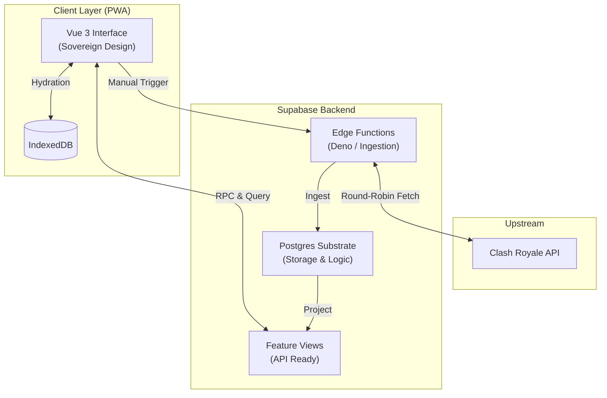

<div align="center">
  
</div>

---

# Clash Manager

[](Backend/README.md)
[](Frontend-PWA/README.md)
[](.github/authoritative-design-references/CleanStack%20Architecture.md)
[](LICENSE)

**An engineered ecosystem for high-precision clan leadership.**

Clash Manager is a production-grade, distributed architecture designed to automate the administrative complexities of competitive Clash Royale clans. It orchestrates a synchronized **Supabase Binary Stack** comprising an edge-native ingestion engine and a live-synchronized, persistence-backed progressive web application.

---
<br />

## Screenshots

<div align="left">
  <details style="margin-bottom: 16px; border: 1px solid #3178C6; border-radius: 10px; background-color: #f6f8fa;">
    <summary style="cursor: pointer; color: #3178C6; padding: 10px; font-family: -apple-system, BlinkMacSystemFont, 'Segoe UI', Helvetica, Arial, sans-serif;">
      <strong>Light Mode</strong>
    </summary>
    <div style="display: flex; flex-wrap: wrap; align-items: flex-start; gap: 10px; padding: 10px; background-color: #ffffff; border-bottom-left-radius: 10px; border-bottom-right-radius: 10px;">
      
      
      
      
    </div>
  </details>

  <details style="margin-bottom: 16px; border: 1px solid #3178C6; border-radius: 10px; background-color: #161b22;">
    <summary style="cursor: pointer; color: #3178C6; padding: 10px; font-family: -apple-system, BlinkMacSystemFont, 'Segoe UI', Helvetica, Arial, sans-serif;">
      <strong>Dark Mode</strong>
    </summary>
    <div style="display: flex; flex-wrap: wrap; align-items: flex-start; gap: 10px; padding: 10px; background-color: #0d1117; border-bottom-left-radius: 10px; border-bottom-right-radius: 10px;">
      
      
      
      
    </div>
  </details>
</div>

---
<br />

## Mission Architecture

Most clan tools rely on ephemeral API fetches-displaying a snapshot of the present moment that vanishes upon refresh. **Clash Manager is different.**

### Persistence vs. Ephemerality
The system builds a **Persistent Clan Database** in Supabase. By archiving every war, every donation cycle, and every member interaction, the system constructs a rich historical tapestry. This allows for deep trend analysis, "heritage" tracking for long-term members, and the ability to spot performance decay before it becomes a problem.

### The Scoring Engine
The system replaces intuition with a **Complex Valuation Metric** that sorts players by their true worth across two distinct dimensions.

<details>
<summary><strong>Internal Metrics: Clan Roster (RPeS & PeS)</strong></summary>

- **RPeS (Raw Performance Score)**: The absolute value derived from a member's contributions while being part of the clan (donations, war fame, war participation, trophies, tenure, Clan Voyage participation).
- **PeS (Performance Score)**: A relative percentage (0-100%) normalized against active clan benchmarks and adjusted via Inertia & Heritage logic.
- **Inertia & Heritage**: Algorithmic decay applied to stagnant profiles, balanced by momentum tracking for incoming recruits to eliminate historic stat bias.


</details>

<details>
<summary><strong>External Metrics: Headhunter Scouting (RPoS & PoS)</strong></summary>

- **RPoS (Raw Potential Score)**: Calculated from a recruit's lifetime external battle logs, donations and war consistency.
- **PoS (Potential Score)**: A relative percentage (0-100%) normalized against the last month of scouted recruits and compared against the current internal clan performance for coherency.

</details>

### The Headhunter Protocol
Recruitment is no longer passive. The **Headhunter Engine** continuously scans global tournament brackets and active members' battle logs via Supabase Edge Functions to identify elite, clanless recruits.
- **Edge-Native Discovery**: High-concurrency Deno functions scan tournaments and active member battles around the clock.
- **Smart Filtering**: Valibot-enforced validation ensures only top-tier candidates reach the UI.
- **Batch Operations**: Sequence-driven blitzing allows leaders to invite recruits in minutes.

---
<br />

## Dictionary

- **DeepNet**: The high-performance, sovereign PWA infrastructure featuring intelligent local caching and live synchronization for administrative clan operations.
- **Headhunter**: The global discovery engine that autonomously scans tournaments and active members' battles to identify elite, clanless recruits.
- **Nightly**: The automated, multi-stage maintenance pipeline that ensures monorepo-wide structural integrity and synchronization.

---
<br />

## System Ecosystem

<details>
<summary><strong>Supabase Backend (Binary Stack)</strong></summary>

The central nervous system. A high-performance infrastructure hosted on **Supabase**.
- **Role**: Orchestrates ingestion pipelines, manages persistent state, and exposes materialized features.
- **Architecture**: Unitary Database with isolated `substrate`, `drivers`, and `features` schemas.
- **Documentation**: [Read Technical Specifications](Backend/README.md)

</details>

<details>
<summary><strong>Client Core (PWA)</strong></summary>

The command center. A **Vue 3.5 Progressive Web Application** designed for administrative operations.
- **Role**: Provides a fluid, low-latency interface for data visualization and deeper analytics.
- **Features**: Sovereign Design System, Persistent Caching (IndexedDB), and Hardware Haptics.
- **Documentation**: [Read Technical Specifications](Frontend-PWA/README.md)

</details>

---
<br />

## Architectural Topology

<details>
<summary><strong>View System Data Flow</strong></summary>

The system utilizes a linear, high-integrity data flow with sub-second interaction latency.


```mermaid
flowchart TD
    subgraph Upstream
        CRAPI["Clash Royale API"]
    end

    subgraph "Supabase Backend"
        Edge["Edge Functions<br/>(Deno / Ingestion)"]
        DB["Postgres Substrate<br/>(Storage & Logic)"]
        Views["Feature Views<br/>(API Ready)"]
    end

    subgraph "Client Layer (PWA)"
        UI["Vue 3 Interface<br/>(Sovereign Design)"]
        Cache[(IndexedDB)]
    end

    Edge <-->|Round-Robin Fetch| CRAPI
    Edge -->|Ingest| DB
    DB -->|Project| Views
    UI <-->|RPC & Query| Views
    UI <-->|Hydration| Cache
    UI -->|Manual Trigger| Edge
```

</details>

---
<br />

## Android Wrapper Application (APK)

The Android wrapper integrates a custom Kotlin native layer directly on top of the PWA shell. The decoded, rebuildable APK source tree is tracked directly in the repository at [APK/README.md](file:///Users/ADR/Documents/Github/Projects/clash-manager/APK/README.md).

The launcher and theme assets are managed via a programmatic icon generation pipeline:

| Layer | Source Description |
| :--- | :--- |
| `background` | `@color/ic_launcher_background` - solid brand `#0B0E14` |
| `foreground` | Logo scaled to fit the 108dp safe zone based on vector dimensions |
| `monochrome` | White silhouette for themed launcher support |
| legacy | Pre-masked square and circular PNG fallbacks for legacy systems |

### Build and Invalidation Protocol

Generate the icon set and compile the project using local scripts:

```bash
pnpm icons:android                      # Regenerate the adaptive icon set
pnpm icons:android : --preview         # Generate launcher preview templates
pnpm apk:check                          # Build and run verification checks locally
```

The icon generator is idempotent and validates asset coordinates against the active res tree. The target root can be overridden with `ANDROID_RES_DIR`.

---
<br />

## Nightly Pipeline

The Nightly pipeline is an automated maintenance and optimization engine designed as a **12-stage multi-agent system** to enforce structural purity, optimize performance, and synchronize system documentation. Running nightly on the `Nightly` branch, this sequenced pipeline executes key phases to keep the monorepo pristine:

1.  **Harden**: The Runtime Integrity Auditor. Secures validation boundaries and eliminates the "any" plague across the stack.
2.  **Verify**: The Logic Integrity Auditor. Proves system integrity through automated test suite execution and logic proofs.
3.  **Baseline Consolidation**: The Declarative Schema Hardener. Hardens database schemas and consolidates incremental migrations into the master baseline.
4.  **Optimize**: The Substrate Hygiene Engineer. Refines code structures, enforces DRY principles, and prunes dead code.
5.  **Document (README)**: The Architecture Truth Architect. Synchronizes technical blueprints with the implementation state (reconciles documentation drift).
6.  **Document (TSDoc)**: The Interface Contract Architect. Hardens interface contracts and architectural remarks via TSDoc.
7.  **Version Integrity**: The Version Consistency Auditor. Eliminates version drift and enforces semantic versioning across the monorepo.
8.  **Dependency Audit**: The External Health Auditor. Monitors external dependency health and security.
9.  **Refactor**: The Structural Surgery Engineer. Orchestrates large-scale structural improvements and architectural migrations.
10. **APK & PWA Wrapper Integrity Auditor**: Secures shell configuration boundaries, runtime safety, and configuration drift.
11. **APK & Native Wrapper Optimizations**: Optimizes compilation assets, native caches, and native webview performance bounds.
12. **Hybrid Shell UX & UI Auditor**: Verifies fluid native-wrapper responsiveness, screen transitions, and gesture integration under webview contexts.

---
<br />

## License

**GNU GPL v3**.
Copyright (c) 2026 AlbiDR.
This project is free software and available under the [GPL v3 License](LICENSE).
