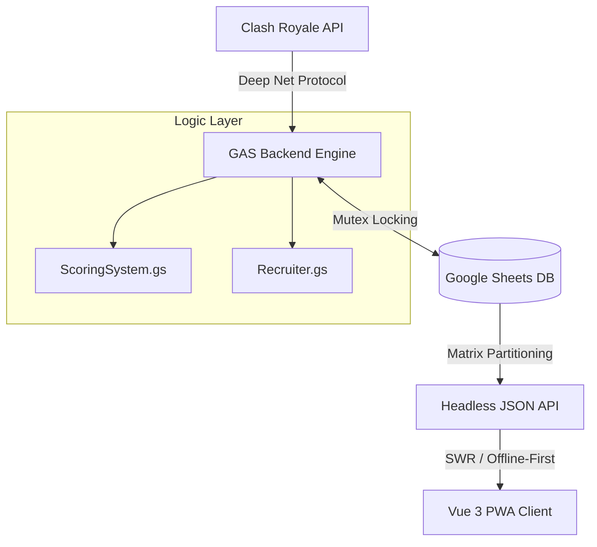

# Clash Manager: Clan Manager for Clash Royale

-FFD700?style=flat-square&logo=clashroyale&logoColor=white)

**Clash Manager** is a high-performance clan management suite for Clash Royale leaders. It bridges the gap between raw data analysis and a **native-quality** mobile experience by combining a **Serverless Google Apps Script Backend** with a **Progressive Web App (PWA)**.

> [!IMPORTANT]
> This project is designed for high reliability. It features a **Portfolio Demo Mode** (Settings > Extra Features) that allows recruiters to explore the full interface with realistic mock data even when backend services are offline.

---

## 🏗️ Technical Architecture

Clash Manager uses a hybrid **SWR (Stale-While-Revalidate)** architecture. Google Sheets acts as the system of record (Database), while the GAS engine handles heavy ETL (Extract, Transform, Load) jobs.

```mermaid
graph TD
    CRAPI[Clash Royale API] -->|Deep Net Protocol| GAS[GAS Backend Engine]
    GAS <-->|Mutex Locking| GS[(Google Sheets DB)]
    GS -->|Matrix Partitioning| API[Headless JSON API]
    API -->|SWR / Offline-First| PWA[Vue 3 PWA Client]
    
    subgraph "Logic Layer"
    GAS --> Scoring[ScoringSystem.gs]
    GAS --> Recruiter[Recruiter.gs]
    end
```

### 🧠 The Scoring Engine (Performance Modeling)
Unlike basic stat trackers, Clash Manager uses a proprietary `ScoringSystem` to model a player's "True Value."

- **Hybrid Participation Logic**: 
    - *Grace Period*: During Training Days (Mon-Wed), 0 Fame is ignored to avoid penalizing players during cool-downs.
    - *Strict Mode*: During Battle Days (Thu-Sun), the denominator remains locked, causing scores to drop instantly if attacks are missed.

---

## 🥇 Gold Standard Scoring (Performance Formula)
Clash Manager intentionally models performance with multiple orthogonal signals (recency, historical consistency, contribution, reliability, and a lightweight popularity signal). The scoring formula is implemented in `Backend-GAS/ScoringSystem.gs.js` and uses weights defined in `Backend-GAS/Configuration.gs.js`.

The canonical Performance Score is written in LaTeX for clarity and the "Lead Architect" aesthetic:

$$
\text{Performance Score} = \left[ (\text{Current Fame} \times 3) + (\text{Avg Fame} \times 15) + (\text{Donations} \times 50) + (\text{Trophies} \times 0.0002) + (\text{War Rate} \times 150) \right] \\
\times \left(0.92^{\max(0, \text{Days Inactive} - 4)}\right)
$$

Notes on the components and weighting rationale:

- **Current Fame (×3)** — captures a player's short-term impact (burst performance); lower weight avoids over-reacting to a single good week.
- **Avg Fame (×15)** — stabilizes ranking using historical context; it prevents noisy swings and rewards consistent performers.
- **Donations (×50)** — a high weight to incentivize community contribution; donations are a strong signal of active, helpful players.
- **Trophies (×0.0002)** — trophies are a coarse metric with large absolute values; the tiny multiplier normalizes trophies to a comparable scale so they act as a tie-breaker rather than dominate the score.
- **War Rate (×150)** — intentionally large: War Rate is a 0–100 percentage measuring reliability; multiplying by 150 elevates reliability above raw statistical noise so regular participants surface to the top.
- **Decay (0.92 per day after 4-day grace)** — implemented as an exponential decay (8% per day beyond a 4-day inactivity grace window). This rapidly reduces inflated scores for players who go inactive while preserving short absences.

Why this is superior to "simple" leaderboards:

- **Multi-dimensional**: Combines recency, history, contribution, and reliability rather than relying on a single metric (e.g., trophies).
- **Robust to noise**: The average fame and explicit decay reduce churn and make rankings more meaningful over time.
- **Actionable**: War Rate and Donations highlight players who both participate and support the clan community — exactly what leaders care about.

Example (illustrative):

- Current Fame = 40, Avg Fame = 30, Donations = 120, Trophies = 5000, War Rate = 90%, Days Inactive = 6

Raw = (40×3) + (30×15) + (120×50) + (5000×0.0002) + (90×150)
 = 120 + 450 + 6000 + 1 + 13,500 = 20,071

Decay factor = 0.92^(max(0, 6−4)) = 0.92^2 ≈ 0.8464

Performance Score ≈ 20,071 × 0.8464 ≈ 16,987

---

- **Inactivity Decay (Implementation)**: High-scoring players who stop playing have their raw scores decayed exponentially using the configured decay rate and grace days from `Configuration.gs.js`.

(For exact implementation, see `Backend-GAS/ScoringSystem.gs.js` and `Backend-GAS/Configuration.gs.js`.)

### 🔭 The Headhunter (Deep Net Protocol)
To find clanless talent, the recruiter module implements a recursive tournament scan:
1. **Keyword Broadcast**: Parallel search for all alphanumeric tournament tags.
2. **Stochastic Filter**: Randomly samples 150 tournaments from the top 800 by capacity.
3. **Log Extraction**: Fetches Battle Logs for 100+ clanless candidates to identify "War Activity" beyond simple trophy counts.

---

## 🔥 Key Frontend Features

### ✨ Fluid Motion System
- **Auto-Animate**: Fluid, physics-based list transitions using `@formkit/auto-animate`. Sorting members or recruits feels responsive and tactile.
- **Glassmorphism**: A curated M3-inspired theme with obsidian depth and tonal palettes.
- **Haptic Feedback**: Standardized vibration patterns for selections, successes, and errors.

### 🛡️ Safety & Reliability
- **Error Boundaries**: Component-level recovery. If a view fails, the app catches the exception and offers a "System Recovery" state rather than crashing.
- **Offline-First**: Powered by Service Workers and IndexedDB. You can view your clan data mid-flight or in low-connectivity areas.

---

## 📂 Monorepo Structure

- **[`/Backend-GAS`](./Backend-GAS)**: Google Apps Script source code.
    - `Controller`: Data compression and JSON matrix generation.
    - `ScoringSystem`: Pure mathematical logic.
    - `Leaderboard`: Weekly aggregation and history rehydration.
- **[`/Frontend-PWA`](./Frontend-PWA)**: Vue 3 + Vite PWA.
    - `src/composables`: Logic extraction (useDemoMode, useClanData, useHaptics).
    - `src/utils/mockData`: The engine powering the Portfolio Demo Mode.

---

## 🚀 Getting Started

1. **Deploy Backend**: Follow the [Backend Guide](./Backend-GAS/README.md).
2. **Deploy Frontend**: Follow the [Frontend Guide](./Frontend-PWA/README.md).
3. **Demo Mode**: If you are exploring this repo for a portfolio review, toggle the "Portfolio Demo Mode" in **Settings > Extra Features** on the live site.

---

## 📄 License

Proprietary.  
Copyright © 2026 AlbiDR.
