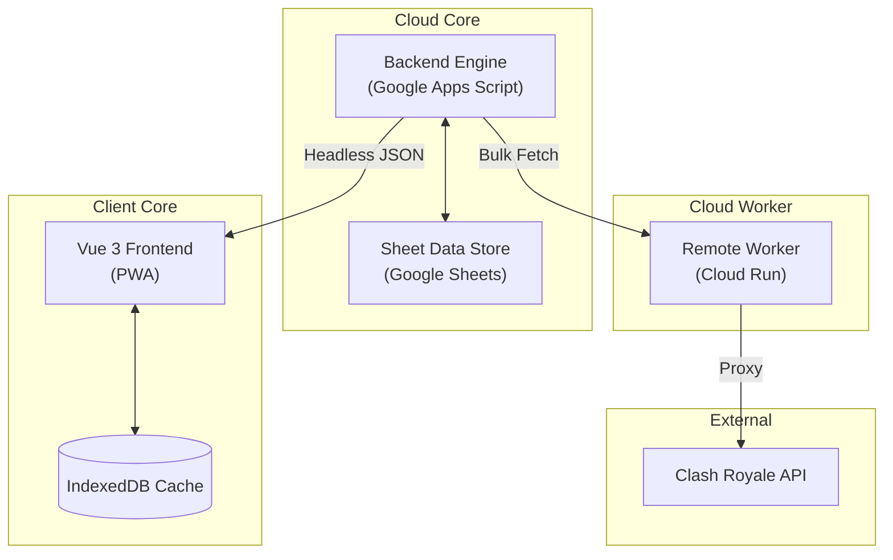

# Clash Manager: Clan Manager for Clash Royale

[](https://github.com/albidr/Clash-Manager) [](docs/ARCHITECTURE.md)

A high-precision, production-grade toolkit for elite Clash Royale clan leadership. This system orchestrates a synchronized stack: a **Google Apps Script Backend** for heavy-lift ETL, and a versatile **Frontend Core** that operates as a **Standalone Progressive Web App (PWA)** which supports virtually any platform.

---

## Architecture

<details>
<summary>View System Diagram</summary>

The system is designed for high data integrity and low-latency interaction.


```mermaid
flowchart TD
    subgraph External
        CRAPI["Clash Royale API"]
    end

    subgraph "Cloud Core"
        GAS["Backend Engine<br/>(Google Apps Script)"]
        GS["Sheet Data Store<br/>(Google Sheets)"]
    end

    subgraph "Cloud Worker"
        Worker["Remote Worker<br/>(Cloud Run)"]
    end

    subgraph "Client Core"
        VueUI["Vue 3 Frontend<br/>(PWA)"]
        IDB[(IndexedDB Cache)]
    end

    GAS -->|Bulk Fetch| Worker
    Worker -->|Proxy| CRAPI
    GAS <--> GS
    GAS -->|Headless JSON| VueUI
    VueUI <--> IDB
```

### Strategic Components

- **Backend (GAS)**: Handles scheduled ETL, matrix normalization, and the canonical scoring algorithm.
- **Backend Worker (Cloud Run)**: A high-concurrency proxy that offloads bulk URL fetching from the GAS environment to circumvent platform quotas.
- **Client (Vite/Vue)**: An offline-first, glassmorphic UI designed for "Self-Healing" resilience and rapid recruitment workflows.

</details>

---

## Quick Start

The project is composed of a Google Apps Script backend and a Vue 3 frontend. Follow the steps below for local setup.

<details>
<summary><strong>Backend Setup (Google Apps Script)</strong></summary>

1.  **Deploy Engine**: Deploy the code in `Backend-GAS/` via `clasp` or the online script editor.
2.  **Set Properties**: In the script editor, set the required `Script Properties`: `ClanTag` and `WebAppUrl`.
3.  **Configure Triggers**: Configure a time-based trigger for the `hourlyUpdate` function for automated data fetching.

</details>

<details>
<summary><strong>Frontend Setup (PWA)</strong></summary>

1.  **Navigate to Directory**:
    ```bash
    cd Frontend-PWA
    ```

2.  **Install Dependencies**:
    ```bash
    pnpm install
    ```

3.  **Configure Environment**: Create a `.env` file in `Frontend-PWA/` and add the `VITE_GAS_URL` from your backend deployment.
    ```env
    VITE_GAS_URL=https://script.google.com/macros/s/YOUR_DEPLOYMENT_ID/exec
    ```
</details>

The frontend is deployed to GitHub Pages via a GitHub Actions pipeline (`deploy-pwa.yml`).

---

## The Performance Model

<details>
<summary>Explore the Scoring Algorithm</summary>

The core value of Clash Manager is its multi-dimensional scoring algorithm (implemented in `ScoringSystem.gs.js`). It transforms raw metrics into a single, actionable **Performance Score**.

| Metric           |  Factor   | Influence                    |
| :--------------- | :-------: | :--------------------------- |
| **Current Fame** |   `3x`    | Immediate War Impact         |
| **Average Fame** |   `15x`   | Long-term Consistency        |
| **Donations**    |   `50x`   | Clan Economy Contribution    |
| **Trophies**     | `0.0002x` | Skill Weighting (Normalized) |
| **War Rate**     |  `150x`   | Reliability & Participation  |

> [!IMPORTANT] > **Exponential Decay**: Inactivity is penalized after a 4-day grace period using the formula: $Score \times 0.92^{\max(0, \text{Days Inactive} - 4)}$.

</details>

---

## Development & Contributing

We prioritize technical purity and architectural coherence.

- **Refactor First**: If logic violates DRY or Modularization, split it before extending.
- **Test-Driven**: Every feature or hotfix MUST include a `Vitest` suite.
- **Semantic Integrity**: Use [Conventional Commits](https://www.conventionalcommits.org/).

---

## License

Proprietary. © 2026 AlbiDR. All rights reserved.
