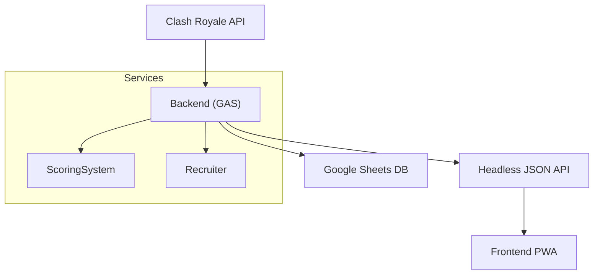

# Clash Manager

 

A concise, production-focused toolkit for clan leadership and recruitment. The **Backend (GAS)** normalizes and aggregates Clash Royale data; the **Vue PWA** provides an offline-capable administrative UI for recruitment and leaderboard workflows.

## Table of contents

- Overview
- Quick start
- Scoring (collapsed)
- Architecture
- Highlights
- Contributing
- License

---

## Overview

Clash Manager aggregates activity (war fame, donations, trophies, etc.) and produces a normalized performance score used to rank members and identify recruit candidates. It is designed for reliability: scheduled ETL, safe concurrency, and compact payloads for fast client rendering.

## Deployment

### Backend (Google Apps Script)

1. Use `clasp` for local development and versioned deployments:
   - Install: `npm i -g @google/clasp`
   - Login and clone your Apps Script project, or create a new one.
2. Script properties (Project Settings > Script Properties):
   - `ClanTag` (required)
   - `WebAppUrl` (set after first deploy)
   - Any API keys or integration settings (store in CI secrets when deploying automatically)
3. Deploy as Web App:
   - Execute as: **Me**
   - Access: **Anyone** (or restrict to your org)
4. Triggers: configure time-based triggers for ETL operations; prefer smaller batches and backoff.

### Frontend (PWA)

- Build: `npm run build` (produces `dist/`)
- Hosts: Netlify, Vercel, Firebase Hosting, GitHub Pages. Configure redirects and caching appropriately.
- Web App Manifest: ensure icons and TWA settings are provided when building Android packages.

### CI/CD

- Tests, linting, and security scans run on pushed branches. Only merge to `Stable`/`main` after green CI.
- Security scans: automated secret scanning was previously used but has been removed; consider adding a scheduled non-failing scan or using external scanning tools and configuration to reduce false positives.

### Rollbacks and versioning

- Tag releases with `vX.Y.Z` and keep a changelog for notable changes.
- For backend critical fixes, redeploy a previous Apps Script version as needed.

## Troubleshooting

- Secret scanner false positives: runner tokens may appear in `.git/config`; see `docs/REMEDIATION.md` for guidance on triage.
- Google Apps Script quotas: large ETL jobs may hit execution or API quotas—break jobs into smaller batches and add retries.
- Offline cache issues (PWA): clear site data or unregister service worker when testing updates.

---

## Scoring (expand for details)

Performance model and rationale

Canonical formula (implemented in `Backend-GAS/ScoringSystem.gs.js`):

\[
\text{Performance Score} = \left[ (\text{Current Fame}\times 3) + (\text{Avg Fame}\times 15) + (\text{Donations}\times 50) + (\text{Trophies}\times 0.0002) + (\text{War Rate}\times 150) \right] \\
\times \left(0.92^{\max(0, \text{Days Inactive} - 4)}\right)
\]

Key points:

- Parameters live in `Backend-GAS/Configuration.gs.js` (WEIGHTS and PENALTIES).
- War Rate emphasizes reliability; Donations reward contribution; Avg Fame stabilizes volatility.
- Decay reduces score for inactivity after a short grace period.

Weights (canonical)

| Metric       | Weight |
| ------------ | -----: |
| Current Fame |      3 |
| Avg Fame     |     15 |
| Donations    |     50 |
| Trophies     | 0.0002 |
| War Rate     |    150 |

> Note: These are the canonical weights used in the score implementation and mirrored in `Backend-GAS/Configuration.gs.js` (see `LEADERBOARD.WEIGHTS`). For security scanning and incident response guidance, see `docs/SECRETS.md` and `docs/REMEDIATION.md`.

---

## Architecture

```mermaid
flowchart TD
  CRAPI["Clash Royale API"] --> GAS["Backend (GAS)"]
  GAS --> GS["Google Sheets DB"]
  GAS --> API["Headless JSON API"]
  API --> PWA["Frontend PWA"]

  subgraph Services
    GAS --> Scoring["ScoringSystem"]
    GAS --> Recruiter["Recruiter"]
  end
```

### Overview

The system uses a focused GAS backend to perform scheduled ETL and scoring, Google Sheets as a lightweight structured store, and a Vue 3 PWA for offline-first admin workflows.

### Data flow

1. Scheduled ETL fetches clan and member activity from the Clash Royale API.
2. Data is normalized and aggregated (war history, donations, trophies).
3. ScoringSystem computes a normalized performance score per member.
4. The headless JSON API serves compact payloads for the PWA.

### Design goals

- Small attack surface: minimal backend surface area and read-only public endpoints for data.
- Reliability: ETL runs are idempotent with retries and batching to avoid hitting Apps Script quotas.
- Observability: logs and artifacts (security scan artifacts, health checks) are persisted via CI artifacts and Apps Script logs.

### Scaling notes

- For large clans or many recruits, shard ETL jobs by member ranges and increase cadence with smaller batch sizes.
- Consider moving to a proper datastore if data volume or query complexity increases.

### Security considerations

- Keep secrets out of source control. Use script properties and secure storage for any credentials.
- Secret scanning is not enforced by default in CI; follow the guidance in `docs/REMEDIATION.md` when triaging any findings from external scans.

## Highlights

- Multi-dimensional performance score (impact, stability, reliability, contribution)
- Scheduled ETL and trend analysis
- Recruitment scanning pipeline
- Offline-first PWA with background sync

## Contributing

Thanks for considering contributing — this project values clear, small, and testable changes.

### How to contribute

1. Fork and create a branch named `fix/` or `feat/` from `Stable`.
2. Run tests and linters locally before opening a PR.
3. Keep PRs focused and add a clear description and test plan.

### Coding conventions

- JavaScript/TypeScript: follow project ESLint rules.
- Commit messages: use conventional commits (e.g., `fix:`, `feat:`, `chore:`).

### Tests

- Add unit tests for new logic (Vitest used in PWA).
- For backend, test scoring calculations on a sandbox Google Sheet before deploying.

### Review process

- PRs should include a summary, testing steps, and ideally a screenshot or artifact when applicable.
- Maintain backward compatibility with stored leaderboard format unless a migration is documented.

## License

Proprietary. © 2026 AlbiDR
