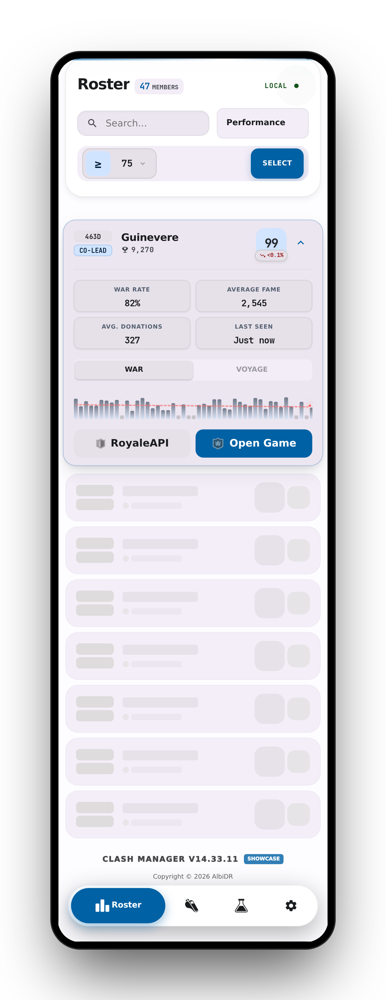
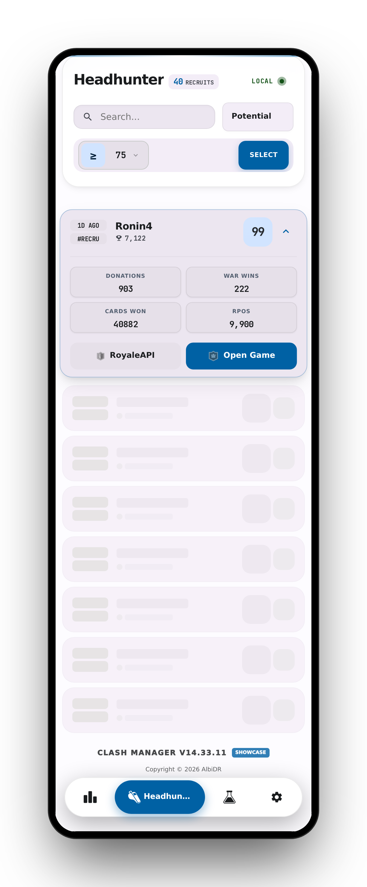
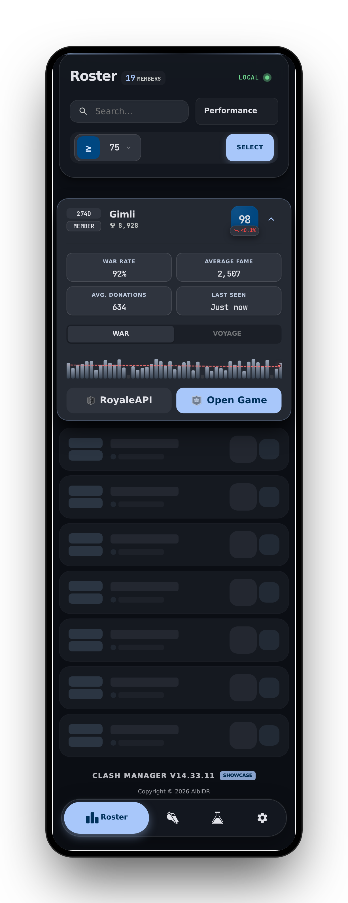
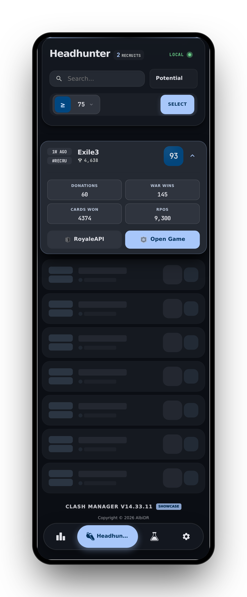
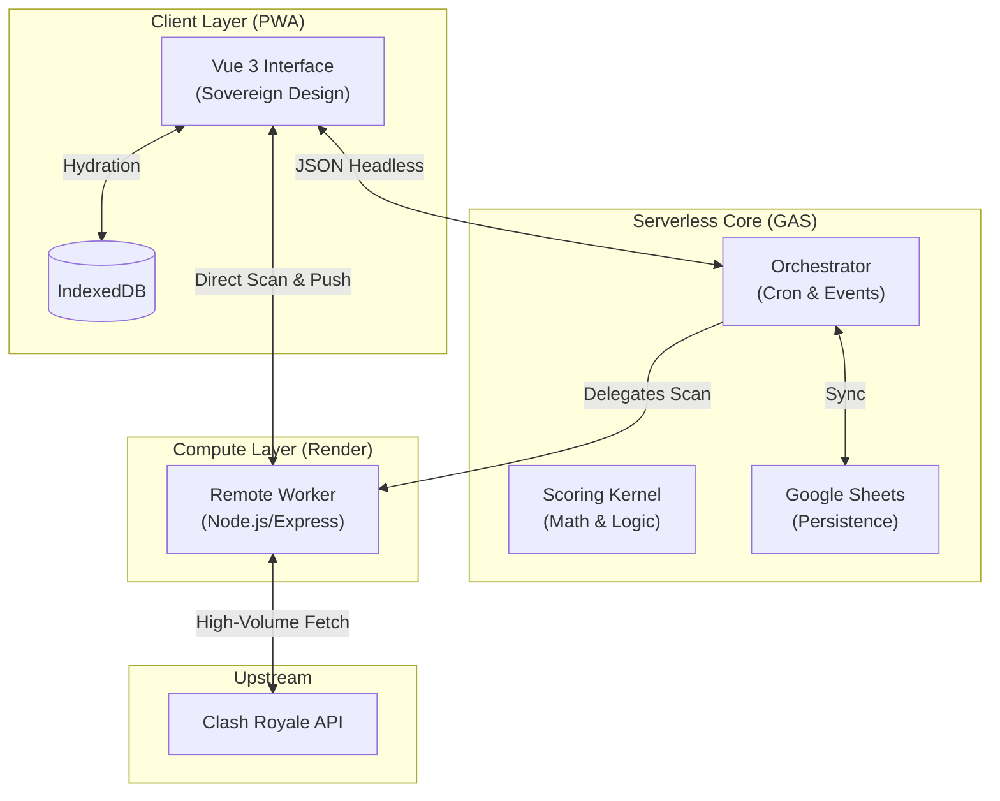

# Clash Manager

**An engineered ecosystem for high-precision clan leadership.**

Clash Manager is a production-grade, distributed architecture designed to automate the administrative complexities of competitive Clash Royale clans. It orchestrates a synchronized stack comprising a serverless orchestration engine, a high-concurrency proxy worker, and an offline-first progressive web application.

---
 

## Screenshots

  

    

      <strong>Light Mode</strong>
    

    

      
      
    

  

  

    

      <strong>Dark Mode</strong>
    

    

      
      
    

  

---
 

## Mission Architecture

Most clan tools rely on ephemeral API fetches—displaying a snapshot of the present moment that vanishes upon refresh. **Clash Manager is different.**

### Persistence vs. Ephemerality
The system builds a **Persistent Clan Database**. By archiving every war, every donation cycle, and every member interaction, the system constructs a rich historical tapestry. This allows for deep trend analysis, "heritage" tracking for long-term members, and the ability to spot performance decay before it becomes a problem.

### The Valuation Engine
Not all members are equal. The system replaces intuition with a **Complex Valuation Metric** that sorts members by their true worth.
- **Raw Score**: Lifetime achievement and grind.
- **Performance Score**: Current form, momentum, and reliability.
- **Inertia**: Penalties for stagnation and inactivity.

This allows leadership to objectively identify the clan's bottom players for rotation and the top clan members for promotion, free from bias.

### The Headhunter Protocol
Recruitment is no longer a passive wait-list. The **Headhunter Engine** continuously scans global tournament brackets, and their individual battles, to populate a pool of high-potential, clanless players.
- **Deep Delegation**: The Worker handles the heavy lifting of scanning and initial scoring, applying a **Prophet Bonus** multiplier to players with proven historical war success.
- **Smart Filtering**: Automatically rejects players who don't meet the clan's exact "Hybrid Benchmark" using Valibot-enforced validation boundaries.
- **Batch Operations**: The PWA allows leaders to select promising recruits and trigger a **Batch Open** flow, launching their in-game profiles sequentially for rapid-fire inviting.

---
 

## System Ecosystem

<strong>Backend Engine (Google Apps Script)</strong>

The central nervous system. A serverless execution engine hosted on **Google Apps Script**.
- **Role**: Orchestrates ETL pipelines, manages persistent state, and executes the proprietary scoring kernel.
- **Architecture**: Registry-based Service Pattern with isolated business modules.
- **Documentation**: [Read Technical Specifications](Backend-GAS/README.md)

<strong>Client Core (PWA)</strong>

The command center. A **Vue 3 Progressive Web Application** designed for administrative operations.
- **Role**: Provides a fluid, low-latency interface for data visualization and deeper analytics.
- **Features**: Sovereign Design System, Offline-First (IndexedDB), and Hardware Haptics.
- **Documentation**: [Read Technical Specifications](Frontend-PWA/README.md)

<strong>Remote Worker (Render)</strong>

The muscle. A high-performance Node.js service hosted on **Render**.
- **Role**: Offloads high-volume network operations and scanning tasks to circumvent platform quotas.
- **Capabilities**: Parallel processing, Smart Key Rotation, and "Headless" API proxying.
- **Documentation**: [Read Technical Specifications](Backend-Worker/README.md)

---
 

## Architectural Topology

The system utilizes a distributed data flow to ensure high integrity and sub-second interaction latency.

```mermaid
flowchart TD
    subgraph Upstream
        CRAPI["Clash Royale API"]
    end

    subgraph "Serverless Core (GAS)"
        Orchestrator["Orchestrator<br/>(Cron & Events)"]
        Kernel["Scoring Kernel<br/>(Math & Logic)"]
        Store["Google Sheets<br/>(Persistence)"]
    end

    subgraph "Compute Layer (Render)"
        Worker["Remote Worker<br/>(Node.js/Express)"]
    end

    subgraph "Client Layer (PWA)"
        UI["Vue 3 Interface<br/>(Sovereign Design)"]
        Cache[(IndexedDB)]
    end

    Orchestrator -->|Delegates Scan| Worker
    Worker <-->|High-Volume Fetch| CRAPI
    Orchestrator <-->|Sync| Store
    UI <-->|JSON Headless| Orchestrator
    UI <-->|Hydration| Cache
    UI <-->|Direct Scan & Push| Worker
```

---
 

## Deployment Protocol

The system requires a synchronized deployment across all three environments.

<strong>Phase 1: Computing Layer (Render)</strong>

The worker must be online first to provide endpoints for the orchestration engine.

  **Source**: `Backend-Worker/`
  **Environment**: Node.js Service
  **Requirements**:
    - `WORKER_CONCURRENCY`: `20`
    - `API_KEYS`: Comma-separated list of tokens.
    - `REMOTE_WORKER_SECRET`: Auth token for worker communication.
  **Action**: `pnpm build && pnpm start`

<strong>Phase 2: Orchestration Engine (Apps Script)</strong>

The Core connects the database (Sheets) to the Worker.

  **Source**: `Backend-GAS/`
  **Environment**: Google Apps Script
  **Configuration**:
    - `REMOTE_WORKER_URL`: The HTTPS endpoint from Phase 1.
    - `CLAN_TAG`: Target resource identifier.
  **Action**: `clasp push` followed by `createTriggers()` in the Orchestrator.

<strong>Phase 3: Operational Interface (PWA)</strong>

The Client consumes the headless JSON API exposed by the Core.

  **Source**: `Frontend-PWA/`
  **Environment**: Static Web Host (e.g., GitHub Pages)
  **Configuration**:
    - `VITE_GAS_URL`: The Web App URL generated in Phase 2.
  **Action**: `pnpm build`

---
 

## Development Standards

The system adheres to a strict "Clean Stack" philosophy to maintain long-term stability and code purity.

- **Pristine Logic**: Business logic is isolated in pure functions (`Scoring_Kernel`) or composables (`useHeadhunter`).
- **Zero-Drift**: All modules must maintain synchronicity with their respective README specifications.
- **Semantic Versioning**: Strict adherence to `Major.Minor.Patch` protocols across the monorepo.
- **Visual Integrity**: The interfaces must strictly follow the Sovereign Design System (No utility-class pollution).

---
 

## License

**GNU GPL v3**.
Copyright (c) 2026 AlbiDR.
This project is free software and available under the [GPL v3 License](LICENSE).
