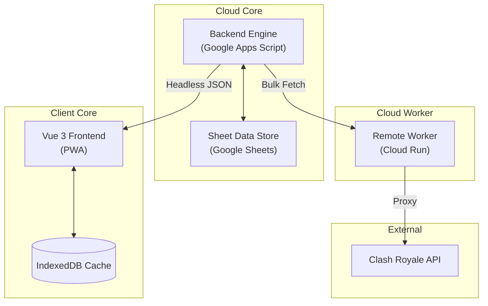

# Clash Manager: Clan Manager for Clash Royale

[](https://github.com/albidr/Clash-Manager)

A high-precision, production-grade toolkit for elite Clash Royale clan leadership. This system orchestrates a synchronized stack: a **Google Apps Script Backend** for heavy-lift ETL, and a versatile **Frontend Core** that operates as a **Standalone Progressive Web App (PWA)** which supports virtually any platform.

---

## Visual Experience

<p align="center">
  The interface adapts fluidly to your device and system theme preferences.
</p>

<p align="center">
  <strong>Desktop Command Center</strong>
</p>

<p align="center">
  
  &nbsp;
  
</p>

<br />

<p align="center">
  <strong>Mobile Operations</strong>
</p>

<p align="center">
  
  &nbsp;&nbsp;&nbsp;&nbsp;
  
</p>

---

## Architecture

The system utilizes a distributed architecture to ensure high data integrity and low-latency interaction. Detailed technical specifications are available in the [Architecture Hub](docs/ARCHITECTURE.md).

<details>
<summary>View System Diagram</summary>


```mermaid
flowchart TD
    subgraph External
        CRAPI["Clash Royale API"]
    end

    subgraph "Cloud Core"
        GAS["Backend Engine<br/>(Google Apps Script)"]
        GS["Sheet Data Store<br/>(Google Sheets)"]
    end

    subgraph "Cloud Worker"
        Worker["Remote Worker<br/>(Cloud Run)"]
    end

    subgraph "Client Core"
        VueUI["Vue 3 Frontend<br/>(PWA)"]
        IDB[(IndexedDB Cache)]
    end

    GAS -->|Bulk Fetch| Worker
    Worker -->|Proxy| CRAPI
    GAS <--> GS
    GAS -->|Headless JSON| VueUI
    VueUI <--> IDB
```

</details>

---

## Quick Start

The project is composed of a Google Apps Script backend, an optional Cloud Run worker, and a Vue 3 frontend. Follow the steps below for local setup.

<details>
<summary><strong>Backend Setup (Google Apps Script)</strong></summary>

1.  **Deploy Engine**: Deploy the code in `Backend-GAS/` via `clasp` or the online script editor.
2.  **Set Properties**: In the script editor, set the required `Script Properties`: `ClanTag` and `WebAppUrl`.
3.  **Configure Triggers**: Open the spreadsheet menu (**👑 Clan Manager > ⚙️ Setup Triggers**) to automatically establish the automation lifecycle (Sync, Scout, and Keep-Alive).

</details>

<details>
<summary><strong>Cloud Worker Setup (Optional)</strong></summary>

The Remote Worker offloads bulk URL fetching to bypass GAS quotas.

1.  **Navigate to Directory**: `cd Backend-Worker`
2.  **Build & Deploy**: Follow the instructions in [Backend-Worker/README.md](Backend-Worker/README.md) to deploy to Google Cloud Run.
3.  **Link to Backend**: Set the `RemoteWorkerUrl` script property in your GAS deployment.

</details>

<details>
<summary><strong>Frontend Setup (PWA)</strong></summary>

1.  **Navigate to Directory**: `cd Frontend-PWA`
2.  **Install Dependencies**: `pnpm install`
3.  **Configure Environment**: Create a `.env` file in `Frontend-PWA/` and add the `VITE_GAS_URL` from your backend deployment.

```env
VITE_GAS_URL=https://script.google.com/macros/s/YOUR_DEPLOYMENT_ID/exec
```

</details>

The frontend is deployed to GitHub Pages via a GitHub Actions pipeline (`deploy-pwa.yml`).

---

## The Performance Model

The core value of Clash Manager is its multi-dimensional scoring algorithm. It transforms raw metrics into a single, actionable **Performance Score** to drive recruitment and clan management decisions.

> **Technical Detail**: The scoring logic and decay formulas are documented in the [Architecture Hub](docs/ARCHITECTURE.md#the-scoring-model).

---

## Contributing

We prioritize technical purity and architectural coherence.

- **Refactor First**: If logic violates DRY or Modularization, split it before extending.
- **Test-Driven**: Every feature or hotfix MUST include a `Vitest` suite.
- **Semantic Integrity**: Use [Conventional Commits](https://www.conventionalcommits.org/).

---

## License

Proprietary. © 2026 AlbiDR. All rights reserved.
