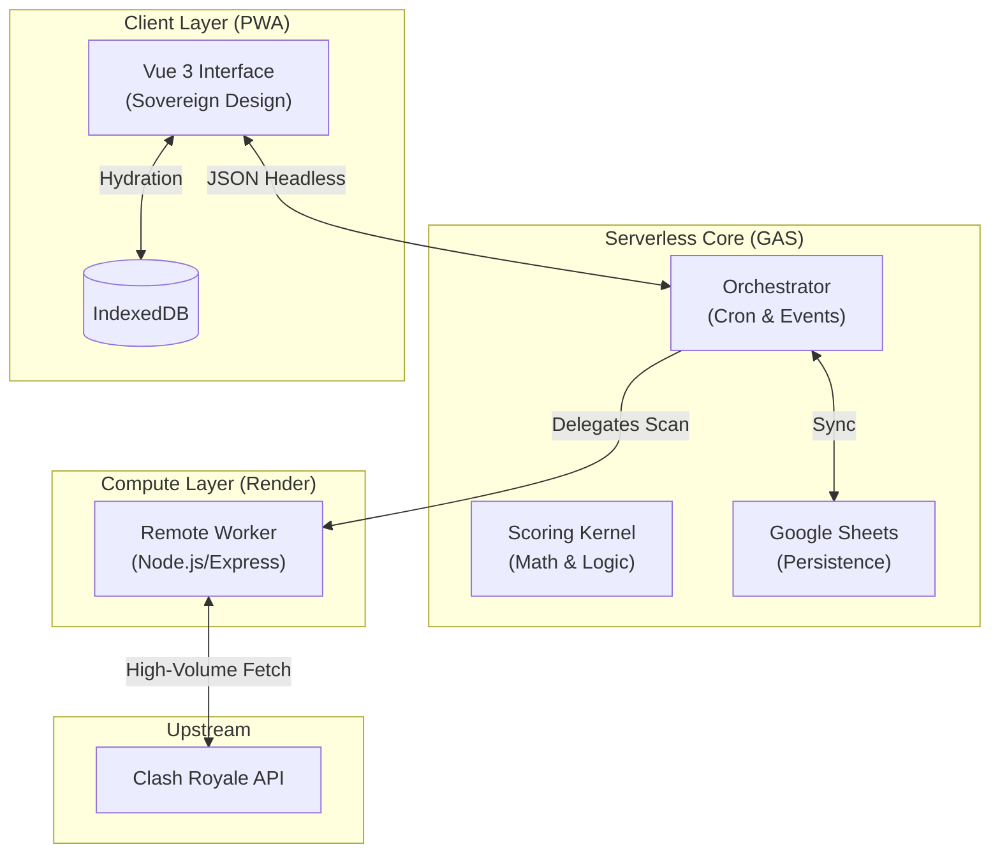

# Clash Manager

**An engineered ecosystem for high-precision clan leadership.**

Clash Manager is a production-grade, distributed architecture designed to automate the administrative complexities of competitive Clash Royale clans. It orchestrates a synchronized stack comprising a serverless orchestration engine, a high-concurrency proxy worker, and an offline-first progressive web application.

---

## System Ecosystem

The architecture is composed of three distinct, loosely coupled domains. Each domain facilitates a specific operational layer of the clan infrastructure.

### 1. Operations Core (`Backend-GAS`)
The central nervous system. A serverless execution engine hosted on **Google Apps Script**.
- **Role**: Orchestrates ETL pipelines, manages persistent state, and executes the proprietary scoring kernel.
- **Architecture**: Registry-based Service Pattern with isolated business modules.
- **Documentation**: [Read Technical Specifications](Backend-GAS/README.md)

### 2. Client Interface (`Frontend-PWA`)
The command center. A **Vue 3 Progressive Web Application** designed for administrative operations.
- **Role**: Provides a fluid, low-latency interface for data visualization and deeper analytics.
- **Features**: Sovereign Design System, Offline-First (IndexedDB), and Hardware Haptics.
- **Documentation**: [Read Technical Specifications](Frontend-PWA/README.md)

### 3. Scaling Engine (`Backend-Worker`)
The muscle. A high-performance Node.js service hosted on **Render**.
- **Role**: Offloads high-volume network operations and scanning tasks to circumvent platform quotas.
- **Capabilities**: Parallel processing, Smart Key Rotation, and "Headless" API proxying.
- **Documentation**: [Read Technical Specifications](Backend-Worker/README.md)

---

## Architectural Topology

The system utilizes a distributed data flow to ensure high integrity and sub-second interaction latency.

```mermaid
flowchart TD
    subgraph Upstream
        CRAPI["Clash Royale API"]
    end

    subgraph "Serverless Core (GAS)"
        Orchestrator["Orchestrator<br/>(Cron & Events)"]
        Kernel["Scoring Kernel<br/>(Math & Logic)"]
        Store["Google Sheets<br/>(Persistence)"]
    end

    subgraph "Compute Layer (Render)"
        Worker["Remote Worker<br/>(Node.js/Express)"]
    end

    subgraph "Client Layer (PWA)"
        UI["Vue 3 Interface<br/>(Sovereign Design)"]
        Cache[(IndexedDB)]
    end

    Orchestrator -->|Delegates Scan| Worker
    Worker <-->|High-Volume Fetch| CRAPI
    Orchestrator <-->|Sync| Store
    UI <-->|JSON Headless| Orchestrator
    UI <-->|Hydration| Cache
```

---

## Deployment Protocol

The system requires a synchronized deployment across all three environments.

<strong>Phase 1: Computing Layer (Render)</strong>

The worker must be online first to provide endpoints for the orchestration engine.

1.  **Source**: `Backend-Worker/`
2.  **Environment**: Node.js Service
3.  **Requirements**:
    *   `WORKER_CONCURRENCY`: `20`
    *   `API_KEYS`: Comma-separated list of tokens.
4.  **Action**: `pnpm build && pnpm start`

<strong>Phase 2: Orchestration Engine (Apps Script)</strong>

The Core connects the database (Sheets) to the Worker.

1.  **Source**: `Backend-GAS/`
2.  **Environment**: Google Apps Script
3.  **Configuration**:
    *   `REMOTE_WORKER_URL`: The HTTPS endpoint from Phase 1.
    *   `CLAN_TAG`: Target resource identifier.
4.  **Action**: `clasp push` followed by `createTriggers()` in the Orchestrator.

<strong>Phase 3: Operational Interface (PWA)</strong>

The Client consumes the headless JSON API exposed by the Core.

1.  **Source**: `Frontend-PWA/`
2.  **Environment**: Static Web Host (e.g., GitHub Pages)
3.  **Configuration**:
    *   `VITE_GAS_URL`: The Web App URL generated in Phase 2.
4.  **Action**: `pnpm build`

---

## Development Standards

We adhere to a strict "Clean Stack" philosophy to maintain long-term stability and code purity.

*   **Pristine Logic**: Business logic is isolated in pure functions (`Scoring_Kernel`) or composables (`useHeadhunter`).
*   **Zero-Drift**: All modules must maintain synchronicity with their respective README specifications.
*   **Semantic Versioning**: Strict adherence to `Major.Minor.Patch` protocols across the monorepo.
*   **Visual Integrity**: The interfaces must strictly follow the Sovereign Design System (No utility-class pollution).

---

## License

**Proprietary Software**.
© 2026 AlbiDR. All rights reserved. 
Unauthorized copying, modification, distribution, or use of this software is strictly prohibited.
