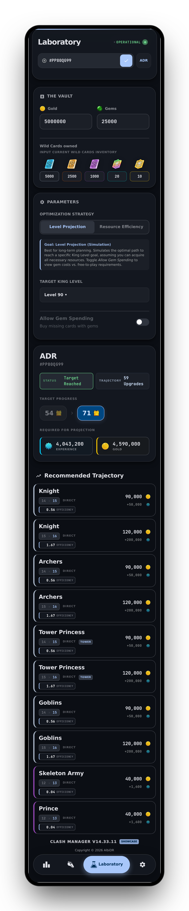
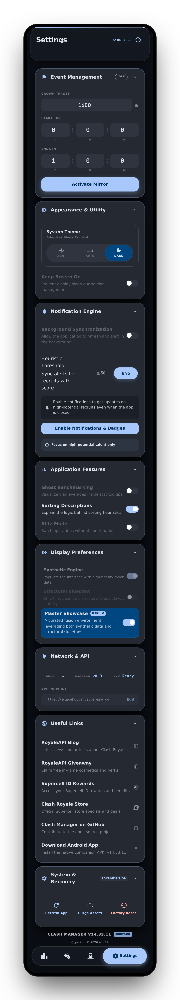
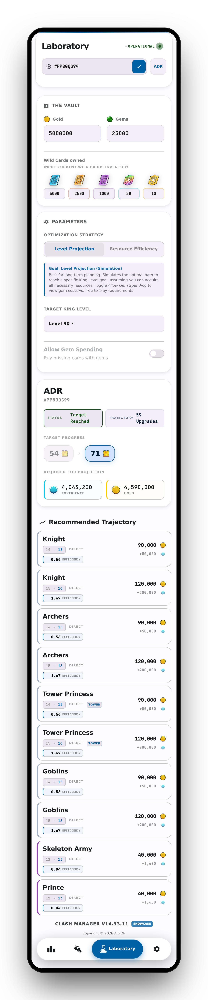
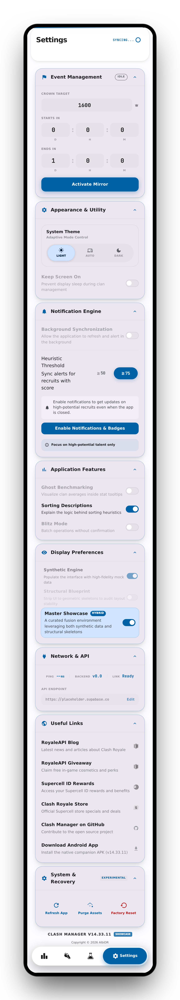
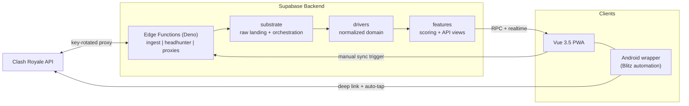

<div align="center">
  

  <h1>Clash Manager</h1>

  <p><strong>Professional recruitment and performance analytics for Clash Royale clan leaders.</strong></p>

  <p>Stop guessing who to keep and who to recruit. Clash Manager scores your whole roster, scouts elite free players across the game, plans every card upgrade, and sends clan invites straight into Clash Royale, all from one installable app.</p>

  [](https://albidr.github.io/Clash-Manager/)
  [](Frontend-PWA/README.md)
  [](Backend/README.md)
  [](APK/README.md)
  [](LICENSE)

  <a href="#features">Features</a> |
  <a href="#how-you-use-it">How you use it</a> |
  <a href="#the-scoring-engine">Scoring engine</a> |
  <a href="#architecture">Architecture</a> |
  <a href="#getting-started">Getting started</a>
</div>

---

## Screenshots

<div align="center">

<details open>
  <summary><strong>Dark mode</strong></summary>
  <br />
  <table>
    <tr>
      <td align="center"></td>
      <td align="center"></td>
    </tr>
    <tr>
      <td align="center"></td>
      <td align="center"></td>
    </tr>
  </table>
</details>

<details>
  <summary><strong>Light mode</strong></summary>
  <br />
  <table>
    <tr>
      <td align="center"></td>
      <td align="center"></td>
    </tr>
    <tr>
      <td align="center"></td>
      <td align="center"></td>
    </tr>
  </table>
</details>

</div>

---

## Why Clash Manager

Most clan tools show you a snapshot: the numbers as they are right now, gone the moment you refresh. Clash Manager keeps history.

Every sync archives your clan's wars, donations, trophies, and battle logs into a persistent database, so the app can do things a live API read never could:

- **Rank people by what they actually contribute**, not by a single stat, using a self-calibrating score that adapts to your clan.
- **Spot decline before it costs you** with per-member trend lines and inactivity decay.
- **Remember your veterans.** A returning member's history follows them back.
- **Find recruits who fit**, scored against your current roster, not against nothing.

It runs as an installable web app on any device, and the [Android build](APK/README.md) adds one trick a browser cannot: it taps "Invite" inside Clash Royale for you.

---

## Features

Clash Manager is organized as four consoles. You move between them from a floating dock at the bottom of the screen.

### [Roster](Frontend-PWA/src/features/roster/README.md): know exactly where your clan stands

The Roster ranks every member by a **Performance Score (0-100)** and lets you drill into the story behind each number.

- **Ranked member cards** sorted by Performance, Momentum, Trophies, Donations, Tenure, Name, or Last Seen, with instant search by name or tag.
- **Expand any member** for war rate, average fame, average daily donations, and last-seen, each with a tooltip comparing that player to the clan average.
- **Trend charts** drawn from real history, with a best-fit line and a predicted next value, toggleable between War and Voyage performance.
- **Momentum indicator** showing whether a member is climbing or slipping.
- **Bulk actions**: select many members at once (or everyone above a score threshold) and open their profiles, or fire them all into game in sequence through Blitz mode.

### [Headhunter](Frontend-PWA/src/features/headhunter/README.md): recruit elite free players on autopilot

The Headhunter is a live feed of clanless players discovered from tournaments and leaderboards, each scored by **Potential Score** against your own roster so you know a prospect is genuinely an upgrade.

- **Top prospects, continuously scouted** by the backend and ranked by potential; expand a card for donations, win rate, cards won, and the raw potential score, each benchmarked against your clan and against all other prospects.
- **Dismiss with one tap and undo.** Rejections hide instantly, sync across your devices and browser tabs, and stay hidden for 30 days.
- **Leaderboard harvest**: pull clanless players straight off the global or your local Path of Legends leaderboard on demand.
- **Blitz recruiting**: multi-select prospects and Clash Manager opens each one's profile in Clash Royale back to back. On Android it goes further and automatically invites the prospect for you (see [Blitz Mode](#the-android-app-blitz-mode)).
- **Alerts**: get a notification and an app badge when new recruits cross the score threshold you set, even with the app closed.

### [Laboratory](Frontend-PWA/src/features/laboratory/README.md): plan every upgrade before you spend a gem

The Laboratory simulates the cheapest path to a target King Level so you never waste gold or wild cards on the wrong card.

- **Load any player** by tag; their card collection is fetched live and normalized to a common 1-16 level scale.
- **The Vault**: enter your real gold, gems, and wild cards per rarity.
- **Two strategies**: *Level Projection* (reach a target King Level assuming you can farm the resources) or *Resource Efficiency* (the best experience-per-gold return using only what you own right now), with an optional gem-spending toggle.
- **Instant projection**: current vs projected King Level, plus total XP gained and gold and gems spent.
- **A step-by-step trajectory**: the exact upgrade order to follow, each step showing the card, level jump, cost, and efficiency.

### [Settings](Frontend-PWA/src/features/settings/README.md): configure, track events, recover

Settings is where you tune the app and run clan-wide operations.

- **Clan Voyage tracker**: schedule and monitor a live Clan Voyage event with a target, countdowns, completion percentage, and per-member contributions. It surfaces as a banner on the Roster while active.
- **Appearance**: Light, Dark, or Auto theme, plus keep-screen-awake during long sync sessions.
- **Notifications**: recruit-alert threshold, app badges, and a test notification.
- **Display modes**: Showcase (a curated demo), Blueprint (skeleton layouts for design review), and Synthetic (mock data for offline development).
- **Network**: live API status and a switchable Supabase endpoint.
- **Recovery**: force an update, clear caches non-destructively, or factory-reset the app.

---

## How you use it

Four everyday flows show how the consoles work together.

**Audit your clan**
Open the app; it lands on the Roster and shows your cached members instantly while a fresh sync runs in the background. Sort by Performance, expand the bottom few, and check their trend lines and inactivity. The scores tell you who to coach and who to cut.

**Scout and recruit**
Switch to Headhunter. Skim the top-scored prospects, dismiss the ones who do not fit (with undo if you misfire), then multi-select the keepers and hit Blitz to fire off invites: hands-free on Android, profile-by-profile everywhere else.

**Plan a player's upgrades**
Open the Laboratory, load a player tag, and enter your current gold, gems, and wild cards. Pick a target King Level or optimize for efficiency, and read off the exact upgrade order and the total cost before committing a single resource.

**Run a Clan Voyage**
From the Command Center, schedule a Voyage with a crown target and end time. Track progress live from the banner on your Roster, and see exactly which members are carrying the event.

---

## The scoring engine

Clash Manager replaces gut feeling with two scoring families. Both are **self-calibrating**: they normalize against your live clan and recruit data rather than hard-coded thresholds, so they stay meaningful as the game and your roster evolve.

### Members: Performance Score

| Metric | What it is |
| :--- | :--- |
| **[RPeS](Backend/README.md)** (Raw Performance Score) | An absolute, recency-weighted sum of a member's contribution: current and average war fame, daily donations, trophies, and war participation, adjusted by a loyalty bonus for tenure and an inactivity decay that compounds after a few idle days. Veterans' returning history contributes a heritage bonus. Computed in SQL views in the `features` schema. |
| **[PeS](Frontend-PWA/src/features/roster/README.md)** (Performance Score, 0-100) | RPeS expressed as a percentage of your clan's top performer. This is the number on each member card. |

### Recruits: Potential Score

| Metric | What it is |
| :--- | :--- |
| **[RPoS](Backend/supabase/functions/_shared/README.md)** (Raw Potential Score) | An absolute score for a prospect built from trophies, lifetime donations, and a weighted win rate as the primary signal (three-crown wins count extra), plus small micro-bonuses for legacy war wins, challenge cards, and a Grand Challenge threshold. Computed in `_shared/utils.ts`. |
| **[PoS](Frontend-PWA/src/features/headhunter/README.md)** (Potential Score, 0-100) | RPoS as a percentage of the strongest prospect currently scouted, with a small bonus for returning veterans the clan already knows. Prospects are tiered Elite, High, or Mid. |

Because a member's score is partailly relative to the current roster and a recruit's score is relative to the current recruit pool, a "90" always means "near the top of what you have right now," today and next season alike without drifting from stale targets.

---

## Architecture

Clash Manager is a monorepo with three deployable parts and a data pipeline that turns raw game telemetry into scored, ready-to-read views.


```mermaid
flowchart LR
    CR["Clash Royale API"]

    subgraph Backend["Supabase Backend"]
        direction TB
        Edge["Edge Functions (Deno)<br/>ingest | headhunter | proxies"]
        Raw["substrate<br/>raw landing + orchestration"]
        Dom["drivers<br/>normalized domain"]
        Views["features<br/>scoring + API views"]
        Edge --> Raw --> Dom --> Views
    end

    subgraph Client["Clients"]
        direction TB
        PWA["Vue 3.5 PWA"]
        APK["Android wrapper<br/>(Blitz automation)"]
    end

    CR <-->|key-rotated proxy| Edge
    Views -->|RPC + realtime| PWA
    PWA -->|manual sync trigger| Edge
    PWA --- APK
    APK -->|deep link + auto-tap| CR
```

The frontend follows a strict four-layer **CleanStack** model, enforced automatically by dependency-cruiser on every commit:

| Layer | Scope | May import |
| :--- | :--- | :--- |
| [`@core`](Frontend-PWA/src/core/README.md) | Framework-agnostic infrastructure: API clients, services, theme tokens, utilities | (nothing above it) |
| [`@shared`](Frontend-PWA/src/shared/README.md) | Domain-blind UI building blocks, composables, directives | `@core` |
| [`@features`](Frontend-PWA/src/features/README.md) | Self-contained feature silos: roster, headhunter, laboratory, settings | `@shared`, `@core` |
| [`@app`](Frontend-PWA/src/app/README.md) | Shell, router, and service worker that wire it all together | everything below |

A feature never imports another feature. Shared logic lives in `@shared` or `@core`. The full ruleset is the [CleanStack Architecture reference](.github/authoritative-design-references/CleanStack%20Architecture.md).

On the backend, data flows one way: Edge Functions fetch and validate game data, land it as raw JSON in the `substrate` schema, database triggers shred that JSON into the normalized `drivers` schema, and the `features` schema computes scores and roster views on read. Nothing enters the database without passing a Valibot schema check, and every table is locked down with row-level security.

---

## Tech stack

| Area | Technology |
| :--- | :--- |
| **Client** | Vue 3.5, TypeScript (strict), Vue Router 5 (experimental data loaders), Pinia, Vite 7 |
| **PWA** | vite-plugin-pwa, Workbox (custom service worker), IndexedDB with in-memory fallback |
| **Validation** | Valibot schema boundaries on all external data, client and server |
| **Backend** | Supabase, Postgres 17, Deno Edge Functions, pg_cron, pg_net, Vault, row-level security |
| **Android** | Custom Java WebView wrapper with an accessibility-driven automation service |
| **Design** | Custom "Neo-Material" system: zero third-party UI, icon, or charting libraries; hand-built SVG icons and charts; self-hosted Inter and JetBrains Mono |
| **Tooling** | pnpm workspace with a version catalog, dependency-cruiser, ast-grep, knip, Vitest, pgTAP |

No component library, no icon pack, no charting dependency. Every icon and chart is drawn by hand in SVG, which keeps full control over styling and the shipped bundle small.

---

## The platform

### Progressive Web App

Clash Manager installs like a native app and is built to survive a hostile network.

- **Offline-ready shell.** The service worker precaches the app and serves it cache-first, so it opens in under a second even offline. Clan data uses a stale-while-revalidate flow: you see cached data instantly, and a background refresh updates it.
- **Live and cross-device.** Recruit dismissals and Voyage state sync in realtime through Supabase and stay consistent across open tabs.
- **OS integration.** App shortcuts, a Web Share target that accepts a shared player tag straight into Headhunter, a `web+clash` protocol handler, desktop side-panel support, app badges, and haptic feedback.
- **Deep game links.** Every player card can open that player's profile directly in Clash Royale.

### The [Android app](APK/README.md): Blitz Mode

The Android build is a custom WebView wrapper around the same PWA, plus a native layer that does what a browser cannot. In **Blitz Mode**, a foreground overlay service and an accessibility service work together to open each selected recruit in Clash Royale and tap the invite button automatically, using coordinates you calibrate once. The PWA drives it through a JavaScript bridge, so multi-select recruiting in the app becomes hands-free invites in the game.

### [Backend](Backend/README.md)

A Supabase project running five Deno Edge Functions behind a rotating pool of ~20 Clash Royale API keys (routed through the RoyaleAPI static-IP proxy). It ingests clan, war, and battle data, discovers recruits, proxies leaderboard and battle-log lookups, and syncs player card collections for the Laboratory.

---

## Autonomous nightly pipeline

This repository maintains itself. Every night an external coding agent runs a **13-stage pipeline** that opens one pull request per stage against the `Nightly` branch: hardening runtime safety, running the test suite, consolidating database migrations, optimizing, refreshing documentation and TSDoc, reconciling versions, auditing dependencies, refactoring, checking the Android wrapper's integrity, optimization, and UX, and finally auditing its own health. Passing work is merged and promoted `Nightly` to `Beta` to `Stable` behind an automated test gate. The rules the agent operates under live in [AGENTS.md](AGENTS.md).

---

## Getting started

### Prerequisites

- Node.js 24+
- pnpm 10+

### Run the app

```bash
git clone https://github.com/albidr/Clash-Manager.git
cd Clash-Manager
pnpm install

pnpm dev:pwa          # start the PWA at http://localhost:5173
```

Point the client at a Supabase project with a `.env` file in `Frontend-PWA/`:

```ini
VITE_SUPABASE_URL=https://your-project.supabase.co
VITE_SUPABASE_PUBLISHABLE_KEY=your-publishable-key
```

### Common commands

```bash
pnpm build            # build every workspace package
pnpm test             # run the full test suite
pnpm apk:check        # compile and verify the Android wrapper (unsigned)
pnpm audit:version    # check version consistency across the monorepo
```

### Repository layout

| Path | What it is |
| :--- | :--- |
| [`Frontend-PWA/`](Frontend-PWA/README.md) | The Vue 3.5 progressive web app |
| [`Backend/`](Backend/README.md) | Supabase database, migrations, and Deno Edge Functions |
| [`APK/`](APK/README.md) | The Android WebView wrapper and its native automation layer |
| [`.github/`](.github/) | CI/CD workflows, quality gates, and the nightly pipeline |
| [`AGENTS.md`](AGENTS.md) | The operating rules for the autonomous pipeline |
| [`DESIGN.md`](DESIGN.md) | The Neo-Material design system |

---

## License

Clash Manager is free software under the [GNU GPL v3](LICENSE).
Copyright (C) 2026 AlbiDR.
