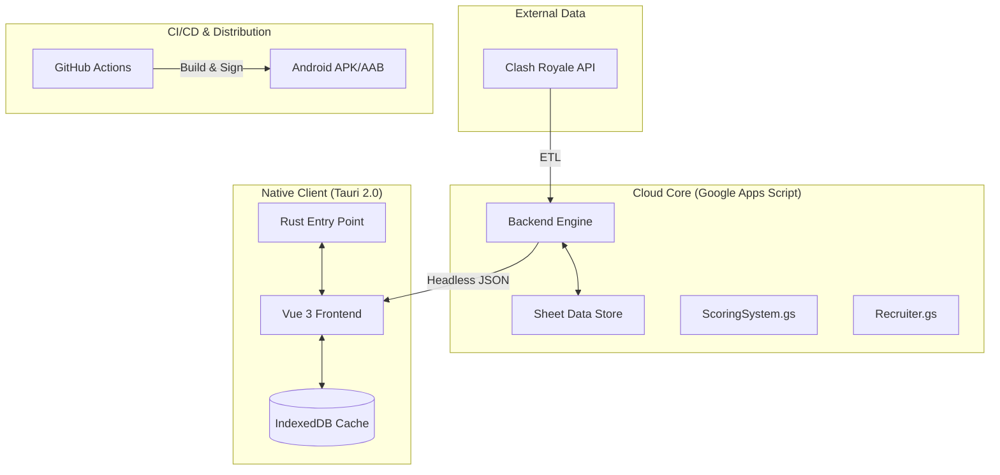

# Clash Manager

[](https://github.com/albidr/Clash-Manager) [](docs/ARCHITECTURE.md)

**Sovereign Clan Intelligence Engine.** A high-precision, production-grade toolkit for elite Clash Royale clan leadership. This system orchestrates a synchronized stack: a **Google Apps Script Backend** for heavy-lift ETL, and a versatile **Frontend Core** that operates as both a **Rust-powered Tauri 2.0 Native App** and a **Standalone Progressive Web App (PWA)** for desktop and browser-based workflows.

---

## 🏛️ Architecture

The system is designed for high data integrity and low-latency interaction.


```mermaid
flowchart TD
    subgraph "External Data"
        CRAPI["Clash Royale API"]
    end

    subgraph "Cloud Core (Google Apps Script)"
        GAS["Backend Engine"]
        GS["Sheet Data Store"]
        Scoring["ScoringSystem.gs"]
        Recruiter["Recruiter.gs"]
    end

    subgraph "Native Client (Tauri 2.0)"
        RustCore["Rust Entry Point"]
        VueUI["Vue 3 Frontend"]
        IDB[(IndexedDB Cache)]
    end

    subgraph "CI/CD & Distribution"
        GA["GitHub Actions"]
        APK["Android APK/AAB"]
    end

    CRAPI -->|ETL| GAS
    GAS <--> GS
    GAS -->|Headless JSON| VueUI
    VueUI <--> IDB
    RustCore <--> VueUI
    GA -->|Build & Sign| APK
```

### Strategic Components

- **Backend (GAS)**: Handles scheduled ETL, matrix normalization, and the canonical scoring algorithm.
- **Client (Vite/Vue/Tauri)**: An offline-first, glassmorphic UI designed for "Self-Healing" resilience and rapid recruitment workflows.
- **Rust Core**: Provides native system hooks, deep-link handling, and crash diagnostics for the Android runtime.

---

## 🚀 Quick Start

### 1. Backend Engine (GAS)

1. Deploy the code in `Backend-GAS/` via `clasp` or the Apps Script Editor.
2. Set Script Properties: `ClanTag`, `WebAppUrl`.
3. Configure time-based triggers for `hourlyUpdate`.

### 2. Client Setup

```bash
cd Frontend-PWA
pnpm install
pnpm tauri android dev  # For local mobile tethering
```

### 3. Automated Android Deployment

The project uses a sophisticated GitHub Actions pipeline (`deploy-android.yml`) that:

- Increments Semantic Versioning based on commit analysis.
- Authenticates and Signs the APK with dedicated keystores.
- Generates categorization-aware changelogs in GitHub Releases.

---

## ⚖️ The Performance Model

The core value of Clash Manager is its multi-dimensional scoring algorithm (implemented in `ScoringSystem.gs.js`). It transforms raw metrics into a single, actionable **Performance Score**.

| Metric           |  Factor   | Influence                    |
| :--------------- | :-------: | :--------------------------- |
| **Current Fame** |   `3x`    | Immediate War Impact         |
| **Average Fame** |   `15x`   | Long-term Consistency        |
| **Donations**    |   `50x`   | Clan Economy Contribution    |
| **Trophies**     | `0.0002x` | Skill Weighting (Normalized) |
| **War Rate**     |  `150x`   | Reliability & Participation  |

> [!IMPORTANT] > **Exponential Decay**: Inactivity is penalized after a 4-day grace period using the formula: $Score \times 0.92^{\max(0, \text{Days Inactive} - 4)}$.

---

## 🛠️ Development & Contributing

We prioritize technical purity and architectural coherence.

- **Refactor First**: If logic violates DRY or Modularization, split it before extending.
- **Test-Driven**: Every feature or hotfix MUST include a `Vitest` suite.
- **Semantic Integrity**: Use [Conventional Commits](https://www.conventionalcommits.org/).

---

## 📜 License

Proprietary. © 2026 AlbiDR. All rights reserved.
