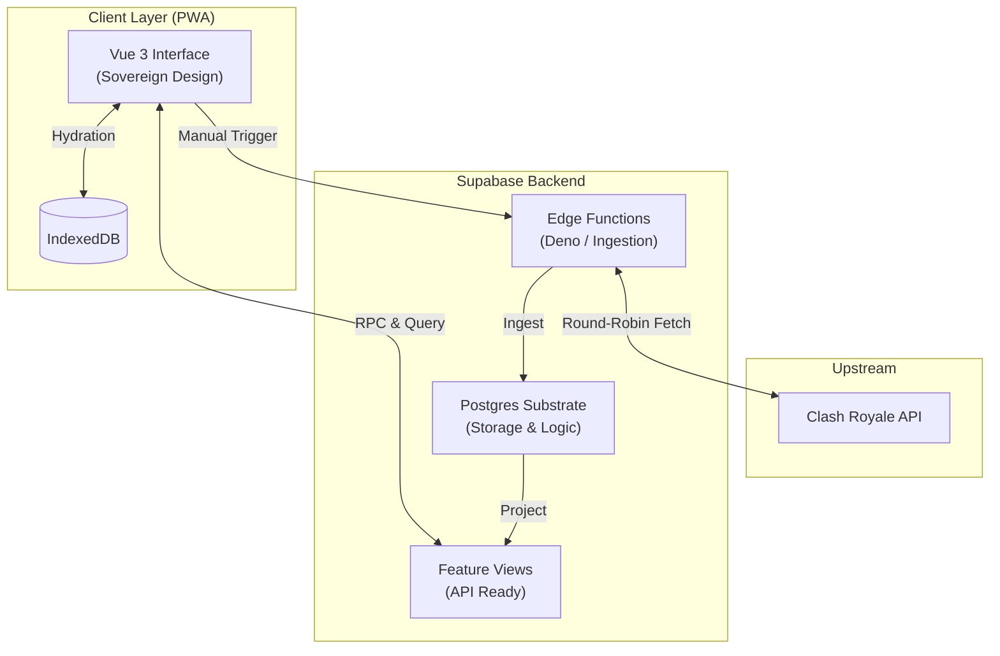

# Clash Manager

**An engineered ecosystem for high-precision clan leadership.**

Clash Manager is a production-grade, distributed architecture designed to automate the administrative complexities of competitive Clash Royale clans. It orchestrates a synchronized **Supabase Binary Stack** comprising an edge-native ingestion engine and an offline-first progressive web application.

---
 

## Screenshots

  

    

      <strong>Light Mode</strong>
    

    

      
      
    

  

  

    

      <strong>Dark Mode</strong>
    

    

      
      
    

  

---
 

## Mission Architecture

Most clan tools rely on ephemeral API fetches—displaying a snapshot of the present moment that vanishes upon refresh. **Clash Manager is different.**

### Persistence vs. Ephemerality
The system builds a **Persistent Clan Database** in Supabase. By archiving every war, every donation cycle, and every member interaction, the system constructs a rich historical tapestry. This allows for deep trend analysis, "heritage" tracking for long-term members, and the ability to spot performance decay before it becomes a problem.

### The Valuation Engine
The system replaces intuition with a **Complex Valuation Metric** that sorts players by their true worth across two distinct dimensions.

<strong>Internal Metrics: Clan Roster (RPeS & PeS)</strong>

- **RPeS (Raw Performance Score)**: The absolute value derived from lifetime stats (donations, war fame, trophies).
- **PeS (Performance Score)**: A relative percentage (0-100%) normalized against the current clan benchmark.
- **Inertia & Heritage**: Logic that applies inactivity decay to stagnant players while providing momentum bonuses to new recruits.

<strong>External Metrics: Headhunter Discovery (RPoS & PoS)</strong>

- **RPoS (Raw Potential Score)**: Calculated from a recruit's external battle logs and war consistency.
- **PoS (Potential Score)**: Normalized potential compared against internal clan performance.

### The Headhunter Protocol
Recruitment is no longer passive. The **Headhunter Engine** continuously scans global tournament brackets via Supabase Edge Functions to identify elite, clanless recruits.
- **Edge-Native Discovery**: High-concurrency Deno functions scan tournaments 24/7.
- **Smart Filtering**: Valibot-enforced validation ensures only top-tier candidates reach the UI.
- **Batch Operations**: Sequence-driven blitzing allows leaders to invite dozens of recruits in minutes.

---
 

## Dictionary

- **DeepNet**: The high-performance, offline-first PWA infrastructure (v7+) designed for administrative clan operations.
- **Headhunter**: The global discovery engine that autonomously scans tournaments to identify elite, clanless recruits.
- **Nightly**: The automated, 7-stage maintenance pipeline that ensures monorepo-wide structural integrity and synchronization.

---
 

## System Ecosystem

<strong>Supabase Backend (Binary Stack)</strong>

The central nervous system. A high-performance infrastructure hosted on **Supabase**.
- **Role**: Orchestrates ingestion pipelines, manages persistent state, and exposes materialized features.
- **Architecture**: Unitary Database with isolated `substrate`, `drivers`, and `features` schemas.
- **Documentation**: [Read Technical Specifications](Backend/README.md)

<strong>Client Core (PWA)</strong>

The command center. A **Vue 3.5 Progressive Web Application** designed for administrative operations.
- **Role**: Provides a fluid, low-latency interface for data visualization and deeper analytics.
- **Features**: Sovereign Design System, Offline-First (IndexedDB), and Hardware Haptics.
- **Documentation**: [Read Technical Specifications](Frontend-PWA/README.md)

---
 

## Architectural Topology

The system utilizes a linear, high-integrity data flow with sub-second interaction latency.

```mermaid
flowchart TD
    subgraph Upstream
        CRAPI["Clash Royale API"]
    end

    subgraph "Supabase Backend"
        Edge["Edge Functions<br/>(Deno / Ingestion)"]
        DB["Postgres Substrate<br/>(Storage & Logic)"]
        Views["Feature Views<br/>(API Ready)"]
    end

    subgraph "Client Layer (PWA)"
        UI["Vue 3 Interface<br/>(Sovereign Design)"]
        Cache[(IndexedDB)]
    end

    Edge <-->|Round-Robin Fetch| CRAPI
    Edge -->|Ingest| DB
    DB -->|Project| Views
    UI <-->|RPC & Query| Views
    UI <-->|Hydration| Cache
    UI -->|Manual Trigger| Edge
```

---
 

## Nightly Pipeline

The ecosystem is maintained by a 7-agent autonomous pipeline that executes nightly to ensure structural purity, security, and documentation synchronization. This pipeline operates directly on the `Nightly` branch and follows a strictly sequenced maintenance cycle:

1.  **Harden**: Secures validation boundaries and eliminates the "any" plague across the stack.
2.  **Verify**: Proves system integrity through automated test suite execution and ADR checks.
3.  **Optimize**: Refines code structures, enforces DRY principles, and prunes dead code.
4.  **Document (README)**: The Structural Archivist. Synchronizes technical blueprints with implementation state.
5.  **Document (TSDoc)**: The Technical Writer. Hardens interface contracts and architectural remarks.
6.  **Version Integrity**: The Release Engineer. Enforces strict semantic versioning.
7.  **Dependency Audit**: The Watchkeeper. Monitors external dependency health and security.

---
 

## Deployment Protocol

The system requires a synchronized deployment across the Supabase and PWA environments.

<strong>Phase 1: Backend Layer (Supabase)</strong>

Deploy the database schema and ingestion functions first.

  **Source**: `Backend/`
  **Requirements**:
    - `ROYALE_API_KEYS`: The Key Farm (10 Supercell JWTs).
    - `CLAN_TAG`: Target resource identifier (SSOT).
  **Action**: 
    1. `supabase link --project-ref <id>`
    2. `supabase db push` (Sync Migrations)
    3. `supabase functions deploy ingest-royale-data`
    4. `supabase functions deploy headhunter-scanner`

<strong>Phase 2: Operational Interface (PWA)</strong>

The Client consumes the features exposed by Supabase.

  **Source**: `Frontend-PWA/`
  **Environment**: Static Web Host
  **Configuration**:
    - `VITE_SUPABASE_URL`: Your project endpoint.
    - `VITE_SUPABASE_PUBLISHABLE_KEY`: The `anon` key.
  **Action**: 
    1. `pnpm build`
    2. Upload the `dist/` directory contents to your host.

---
 

## Development Standards

The system adheres to a strict "Clean Stack" philosophy to maintain long-term stability and code purity.

- **Pristine Logic**: Business logic is isolated in pure functions or Supabase SQL triggers.
- **Zero-Drift**: All modules must maintain synchronicity with their respective README specifications.
- **Semantic Versioning**: Strict adherence to `Major.Minor.Patch` protocols across the monorepo.
- **Visual Integrity**: The interfaces must strictly follow the Sovereign Design System (No utility-class pollution).

---
 

## License

**GNU GPL v3**.
Copyright (c) 2026 AlbiDR.
This project is free software and available under the [GPL v3 License](LICENSE).
