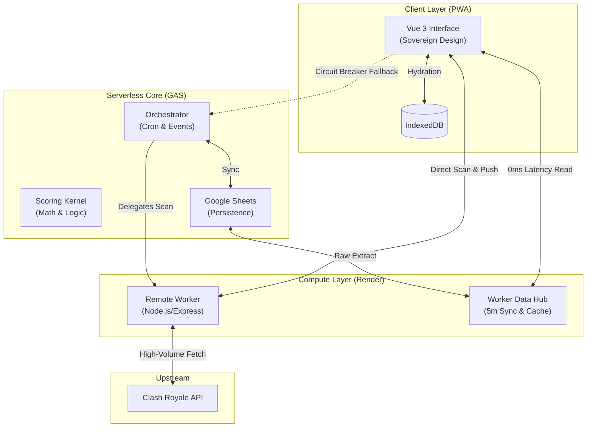

# Clash Manager

**An engineered ecosystem for high-precision clan leadership.**

Clash Manager is a production-grade, distributed architecture designed to automate the administrative complexities of competitive Clash Royale clans. It orchestrates a synchronized stack comprising a serverless orchestration engine, a high-concurrency proxy worker, and an offline-first progressive web application.

---
 

## Screenshots

  

    

      <strong>Light Mode</strong>
    

    

      
      
    

  

  

    

      <strong>Dark Mode</strong>
    

    

      
      
    

  

---
 

## Mission Architecture

Most clan tools rely on ephemeral API fetches—displaying a snapshot of the present moment that vanishes upon refresh. **Clash Manager is different.**

### Persistence vs. Ephemerality
The system builds a **Persistent Clan Database**. By archiving every war, every donation cycle, and every member interaction, the system constructs a rich historical tapestry. This allows for deep trend analysis, "heritage" tracking for long-term members, and the ability to spot performance decay before it becomes a problem.

### The Valuation Engine
Not all members are equal. The system replaces intuition with a **Complex Valuation Metric** that sorts players by their true worth across two distinct dimensions.

<strong>Internal Metrics: Clan Roster (RPeS & PeS)</strong>

The system evaluates active clan members using a dual-score model to distinguish between historical contribution and current momentum.

- **RPeS (Raw Performance Score)**: The absolute mathematical value derived from lifetime stats (donations, war fame, trophies, and participation rate). It represents the total "grind" and historical achievement of a member.
- **PeS (Performance Score)**: A relative percentage (0-100%) that normalizes a member's performance against the current clan benchmark. The top-performing member always represents 100%, and everyone else is scaled accordingly to provide a clear view of current form.
- **Inertia & Heritage**: Logic that applies inactivity decay to stagnant players (Inertia) while providing momentum bonuses to new, promising recruits (Heritage).

<strong>External Metrics: Headhunter Discovery (RPoS & PoS)</strong>

Recruits are analyzed through a similar but specialized lens to ensure they meet the clan's performance standards before they join.

- **RPoS (Raw Potential Score)**: An absolute value calculated from a recruit's external battle logs, lifetime donations, and war consistency.
- **PoS (Potential Score)**: The normalized "Potential" of a candidate. To ensure scoring coherency, RPoS is compared against the internal clan performance (RPeS) using a weighted ratio, producing an aligned score that indicates how well the recruit would fit into the current roster's competitive curve.

This allows leadership to objectively identify the clan's bottom players for rotation and the top candidates for recruitment, free from bias.

### The Headhunter Protocol
Recruitment is no longer a passive wait-list. The **Headhunter Engine** continuously scans global tournament brackets, and their individual battles, to populate a pool of high-potential, clanless players.
- **Agnostic Discovery**: Scans continuously across all tournament states (open, private, full, terminated) using full alphanumeric (`a-z`, `0-9`) search keys to guarantee maximum candidate yield.
- **Deep Delegation**: The Worker handles the heavy lifting of scanning and initial scoring, applying a **Prophet Bonus** multiplier to players with proven historical war success.
- **Smart Filtering**: Automatically rejects players who don't meet the clan's exact "Hybrid Benchmark" using Valibot-enforced validation boundaries.
- **Batch Operations**: The PWA allows leaders to select promising recruits and trigger a **Batch Open** flow, launching their in-game profiles sequentially for rapid-fire inviting.

---
 

## Dictionary

- **DeepNet**: The high-performance, offline-first PWA infrastructure (v7+) designed for administrative clan operations.
- **Headhunter**: The global discovery engine that autonomously scans tournaments to identify elite, clanless recruits.
- **Nightly**: The automated, 7-stage maintenance pipeline that ensures monorepo-wide structural integrity and synchronization.

---
 

## System Ecosystem

<strong>Backend Engine (Google Apps Script)</strong>

The central nervous system. A serverless execution engine hosted on **Google Apps Script**.
- **Role**: Orchestrates ETL pipelines, manages persistent state, and executes the proprietary scoring kernel.
- **Architecture**: Registry-based Service Pattern with isolated business modules.
- **Documentation**: [Read Technical Specifications](Backend-GAS/README.md)

<strong>Client Core (PWA)</strong>

The command center. A **Vue 3 Progressive Web Application** designed for administrative operations.
- **Role**: Provides a fluid, low-latency interface for data visualization and deeper analytics.
- **Features**: Sovereign Design System, Offline-First (IndexedDB), and Hardware Haptics.
- **Documentation**: [Read Technical Specifications](Frontend-PWA/README.md)

<strong>Remote Worker (Render)</strong>

The muscle. A high-performance Node.js service hosted on **Render**.
- **Role**: Offloads high-volume network operations, acts as the primary Data Hub for the PWA, and executes the 5-minute background sync daemon.
- **Capabilities**: Zero-latency L1 Caching (`/hub/state`), Parallel processing, Smart Key Rotation, and "Headless" API proxying.
- **Documentation**: [Read Technical Specifications](Backend-Worker/README.md)

---
 

## Architectural Topology

The system utilizes a distributed data flow to ensure high integrity and sub-second interaction latency.

```mermaid
flowchart TD
    subgraph Upstream
        CRAPI["Clash Royale API"]
    end

    subgraph "Serverless Core (GAS)"
        Orchestrator["Orchestrator<br/>(Cron & Events)"]
        Kernel["Scoring Kernel<br/>(Math & Logic)"]
        Store["Google Sheets<br/>(Persistence)"]
    end

    subgraph "Compute Layer (Render)"
        Worker["Remote Worker<br/>(Node.js/Express)"]
        DataHub["Worker Data Hub<br/>(5m Sync & Cache)"]
    end

    subgraph "Client Layer (PWA)"
        UI["Vue 3 Interface<br/>(Sovereign Design)"]
        Cache[(IndexedDB)]
    end

    Orchestrator -->|Delegates Scan| Worker
    Worker <-->|High-Volume Fetch| CRAPI
    Orchestrator <-->|Sync| Store
    Store <-->|Raw Extract| DataHub
    UI <-->|0ms Latency Read| DataHub
    UI -.->|Circuit Breaker Fallback| Orchestrator
    UI <-->|Hydration| Cache
    UI <-->|Direct Scan & Push| Worker
```

---
 

## Nightly Pipeline

The ecosystem is maintained by a 7-agent autonomous pipeline that executes nightly to ensure structural purity, security, and documentation synchronization. This pipeline operates directly on the `Nightly` branch and follows a strictly sequenced maintenance cycle:

1.  **Harden**: Secures validation boundaries, normalizes data structures, and eliminates the "any" plague across the stack.
2.  **Verify**: Proves system integrity through automated test suite execution and strict architectural compliance (ADR) checks.
3.  **Optimize**: Refines code structures, enforces DRY principles, and prunes dead code or redundant dependencies.
4.  **Document (README)**: The Structural Archivist. Synchronizes high-level technical blueprints with the actual implementation state.
5.  **Document (TSDoc)**: The Technical Writer. Hardens interface contracts and architectural remarks within the source code.
6.  **Version Integrity**: The Release Engineer. Enforces strict semantic versioning and reconciles internal version constants.
7.  **Dependency Audit**: The Watchkeeper. Monitors external dependency health, security vulnerabilities, and runtime currency.

---
 

## Quick Start: API Key Protocol

To enable the **Round-Robin Load Balancer** and preserve system integrity against platform quotas, all API keys must follow a strict naming and provisioning contract:

- **Naming Convention**: Keys MUST be named with the prefix `CRK` followed by a sequential index (e.g., `CRK01`, `CRK02`... `CRK10`).
- **IP Whitelisting**: When creating keys on the Supercell portal, you MUST whitelist the IP `0.0.0.0` (or the specific proxy IPs if using a custom proxy) to allow the **RoyaleAPI Proxy** to communicate on your behalf.
- **Profile Limits**: Supercell allows **10 keys per developer profile**. To maximize concurrency, it is recommended to populate the full `CRK01`–`CRK10` range.
- **Provisioning**:
  - **Worker (Render)**: Defined in the `API_KEYS` environment variable as a comma-separated string.
  - **Core (GAS)**: Defined in **Project Settings > Script Properties** under the `API_KEYS` key.

---
 

## Phase 0: Environment & Prerequisites

Before initiating the deployment, ensure your local environment meets the following technical requirements:

- **Runtime**: Node.js (v24+) and `pnpm` (v10+).
- **Tooling**: `clasp` (Google Apps Script CLI) installed globally (`pnpm add -g @google/clasp`).
- **Auth**: Authenticate clasp with your Google account (`clasp login`).
- **External Intel**: A [Clash Royale Developer](https://developer.clashroyale.com/) account to generate API keys.

---
 

## Deployment Protocol

The system requires a synchronized deployment across all three environments.

<strong>Phase 1: Computing Layer (Render)</strong>

The worker must be online first to provide endpoints for the orchestration engine.

  **Source**: `Backend-Worker/`
  **Environment**: Node.js Service
  **Requirements**:
    - `WORKER_CONCURRENCY`: `20`
    - `API_KEYS`: Comma-separated list of `CRK01..CRK10` tokens.
    - `REMOTE_WORKER_SECRET`: Auth token for worker communication.
  **Action**: `pnpm build && pnpm start`

<strong>Phase 2: Orchestration Engine (Apps Script)</strong>

The Core connects the database (Sheets) to the Worker. This must be a **Container-Bound** script.

  **Source**: `Backend-GAS/`
  **Environment**: Google Apps Script
  **Configuration**:
    - `REMOTE_WORKER_URL`: The HTTPS endpoint from Phase 1.
    - `CLAN_TAG`: Target resource identifier (Clan Tag).
    - `PLAYER_TAG`: (Optional) Personal context for the PWA.
  **Action**: 
    1. Create a new Google Sheet.
    2. `clasp push` from the `Backend-GAS/` directory (ensure `.clasp.json` points to a bound script).
    3. **Enable Advanced Services**: In the Apps Script Editor, go to **Resources > Advanced Google Services** and enable the **Google Sheets API**.
    4. **Authorization**: Run `createTriggers()` once manually from the editor. This will prompt for the necessary Google permissions.
    5. **Deploy as Web App**: Set *Execute as* to `Me` and *Who has access* to `Anyone`.
    6. Run `createTriggers()` in `Orchestrator.ts`.

<strong>Phase 3: Operational Interface (PWA)</strong>

The Client consumes the headless JSON API exposed by the Core.

  **Source**: `Frontend-PWA/`
  **Environment**: Static Web Host (e.g., GitHub Pages, Vercel, Netlify)
  **Configuration**:
    - `VITE_GAS_URL`: The Web App URL generated in Phase 2.
    - `VITE_WORKER_URL`: The HTTPS endpoint from Phase 1.
    - `VITE_USE_WORKER_HUB`: Set to `true` to enable the 0ms latency Worker Data Hub.
  **Action**: 
    1. `pnpm build`
    2. Upload the contents of the `dist/` directory to your static host.
    3. Ensure the `VITE_GAS_URL` is set in your host's environment variables or `.env` file before building.

---
 

## Development Standards

The system adheres to a strict "Clean Stack" philosophy to maintain long-term stability and code purity.

- **Pristine Logic**: Business logic is isolated in pure functions (`Scoring_Kernel`) or composables (`useHeadhunter`).
- **Zero-Drift**: All modules must maintain synchronicity with their respective README specifications.
- **Semantic Versioning**: Strict adherence to `Major.Minor.Patch` protocols across the monorepo.
- **Visual Integrity**: The interfaces must strictly follow the Sovereign Design System (No utility-class pollution).

---
 

## License

**GNU GPL v3**.
Copyright (c) 2026 AlbiDR.
This project is free software and available under the [GPL v3 License](LICENSE).
