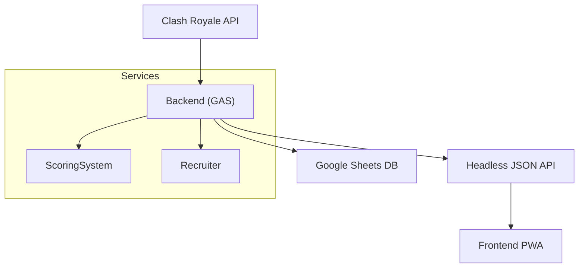

# Clash Manager

 

A concise, production-focused toolkit for clan leadership and recruitment. The **Backend (GAS)** normalizes and aggregates Clash Royale data; the **Vue PWA** provides an offline-capable administrative UI for recruitment and leaderboard workflows.

## Table of contents
- Overview
- Quick start
- Scoring (collapsed)
- Architecture
- Highlights
- Contributing
- License

---

## Overview
Clash Manager aggregates activity (war fame, donations, trophies) and produces a normalized performance score used to rank members and identify recruit candidates. It is designed for reliability: scheduled ETL, safe concurrency, and compact payloads for fast client rendering.

## Quick start
See `docs/DEPLOYMENT.md` for a step-by-step Quick Start and deployment instructions for both backend and frontend.

## Deployment
- Backend (Apps Script): deploy the project as a Web App (execute as `Me`, access `Anyone`), set required script properties (see `Backend-GAS/README.md`), and add time-based triggers for scheduled ETL.
- Frontend (PWA): build (`npm run build`) and deploy to your static host (Netlify, Vercel, Firebase Hosting, or GitHub Pages). For mobile PWAs, see `Frontend-PWA/scripts/build-android.sh` for TWA packaging.

## Troubleshooting
- TruffleHog/GitHub Actions false positives: runner tokens may appear in `.git/config`; see `docs/REMEDIATION.md` for guidance (we now exclude `.git`).
- Google Apps Script quotas: large ETL jobs may hit execution or API quotas—break jobs into smaller batches and add retries.
- Offline cache issues (PWA): clear site data or unregister service worker when testing updates.

---

## Scoring (expand for details)

Performance model and rationale

Canonical formula (implemented in `Backend-GAS/ScoringSystem.gs.js`):

\[
\text{Performance Score} = \left[ (\text{Current Fame}\times 3) + (\text{Avg Fame}\times 15) + (\text{Donations}\times 50) + (\text{Trophies}\times 0.0002) + (\text{War Rate}\times 150) \right] \\
\times \left(0.92^{\max(0, \text{Days Inactive} - 4)}\right)
\]

Key points:
- Parameters live in `Backend-GAS/Configuration.gs.js` (WEIGHTS and PENALTIES).
- War Rate emphasizes reliability; Donations reward contribution; Avg Fame stabilizes volatility.
- Decay reduces score for inactivity after a short grace period.

Weights (canonical)

| Metric | Weight |
|---|---:|
| Current Fame | 3 |
| Avg Fame | 15 |
| Donations | 50 |
| Trophies | 0.0002 |
| War Rate | 150 |

> Note: These are the canonical weights used in the score implementation and mirrored in `Backend-GAS/Configuration.gs.js` (see `LEADERBOARD.WEIGHTS`). For security scanning and incident response guidance, see `docs/SECRETS.md` and `docs/REMEDIATION.md`.

---

## Architecture

```mermaid
flowchart TD
  CRAPI["Clash Royale API"] --> GAS["Backend (GAS)"]
  GAS --> GS["Google Sheets DB"]
  GAS --> API["Headless JSON API"]
  API --> PWA["Frontend PWA"]

  subgraph Services
    GAS --> Scoring["ScoringSystem"]
    GAS --> Recruiter["Recruiter"]
  end
```

## Highlights
- Multi-dimensional performance score (impact, stability, reliability, contribution)
- Scheduled ETL and trend analysis
- Recruitment scanning pipeline
- Offline-first PWA with background sync

## Contributing
See `CONTRIBUTING.md` and the subproject READMEs for development workflows and contribution guidelines.

## License
Proprietary. © 2026 AlbiDR
