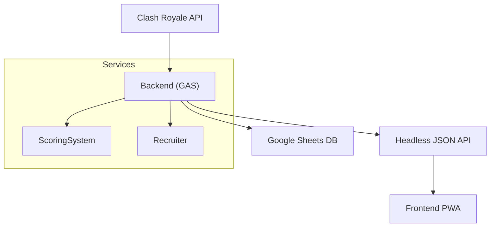

# Architecture

This document explains the high-level architecture of Clash Manager, its components, and the data flows between them.

## Overview
- Backend: Google Apps Script (GAS) performs scheduled ETL, scoring, and exposes a compact headless JSON API.
- Data store: Google Sheets is used as a lightweight structured store for leaderboards and metadata.
- Frontend: Vue 3 PWA consumes the headless API, provides offline UX and recruitment workflows.

## Component diagram

## Data flow
1. Scheduled ETL fetches clan and member activity from the Clash Royale API.
2. Data is normalized and aggregated (war history, donations, trophies).
3. ScoringSystem computes a normalized performance score per member.
4. The headless JSON API serves compact payloads for the PWA.

## Design goals
- Small attack surface: minimal backend surface area and read-only public endpoints for data.
- Reliability: ETL runs are idempotent with retries and batching to avoid hitting Apps Script quotas.
- Observability: logs and artifacts (TruffleHog results, health checks) are persisted via CI artifacts and Google Apps Script logs.

## Scaling notes
- For large clans or many recruits, shard ETL jobs by member ranges and increase cadence with smaller batch sizes.
- Consider moving to a proper datastore if data volume or query complexity increases.

## Security considerations
- Keep secrets out of source control. Use script properties and secure storage for any credentials.
- TruffleHog/Gitleaks are run in CI; ignore `.git` folder when scanning filesystem to avoid runner tokens appearing as false positives (see `docs/REMEDIATION.md`).
