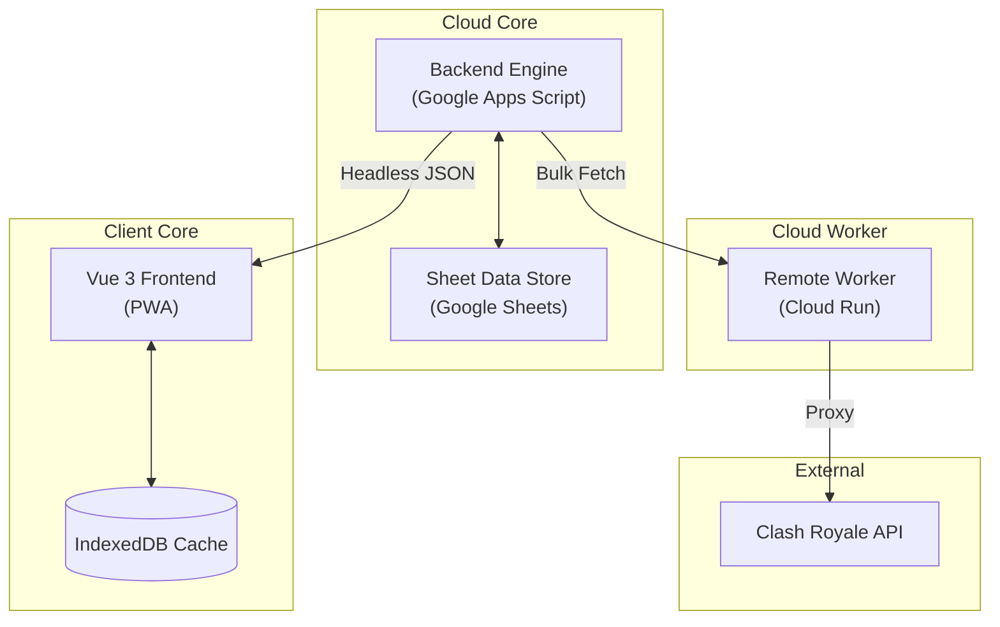

# System Architecture

This document provides a technical overview of the Clash Manager ecosystem, detailing the data flow, component responsibilities, and performance strategies that enable high-precision clan management.

---

## Component Topology

The system is designed for high data integrity and low-latency interaction, utilizing a distributed architecture to bypass platform-specific limitations.

---

## Strategic Components

### 1. Backend Engine (Google Apps Script)
The central nervous system of the project. It handles:
- **Scheduled ETL**: Automated data extraction from the Clash Royale API.
- **Matrix Normalization**: Transposing flat API responses into optimized matrices for lightweight transport.
- **Canonical Scoring**: Implementation of the proprietary performance algorithm.
- **Headless JSON API**: Exposing a single `doGet` endpoint for client interaction.

### 2. Remote Worker (Cloud Run)
A high-concurrency Node.js/Express proxy.
- **Purpose**: Offloads bulk URL fetching from the GAS environment to circumvent the `UrlFetchApp` daily quotas and execution timeouts.
- **Protocol**: Accepts batches of URLs and API keys, returning serialized results in parallel.

### 3. Client Core (Vue 3 PWA)
A modern, offline-first dashboard.
- **Stack**: Vue 3, TypeScript, Tailwind CSS (Sovereign Design System).
- **State Management**: Uses reactive composables with IndexedDB persistence for immediate "Stale-While-Revalidate" (SWR) state.
- **Deployment**: Optimized as a Progressive Web App for cross-platform availability.

---

## Data Protocols

Headless API Handshake

The Backend (GAS) communicates via a standardized JSON envelope.

1.  **Action Routing**: Client requests a specific `action` (e.g., `getwebappdata`).
2.  **Payload Delivery**: Server returns a unified matrix payload containing leaderboard data, historical metrics, and recruiter state.
3.  **Double-Unwrap Protection**: Internal safety envelopes prevent Google's HTML service from corrupting the JSON payload during transport.

Remote Worker Dispatch

When GAS requires high-volume scanning (e.g., during Tournament synchronization):

1.  **Dispatch**: GAS sends a batch of target URLs to the Remote Worker.
2.  **Execution**: The Worker fetches URLs in parallel using a round-robin rotation of provided API keys.
3.  **Aggregation**: Results are serialized and returned to GAS for final scoring and storage.

---

## Performance Strategy

- **v-memo Optimization**: List renders in the PWA use conditional `v-memo` to ensure only expanded items react to background data updates, keeping UI interaction fluid during heavy sync operations.
- **Dynamic Schema Validation**: Uses `valibot` for lightweight, tree-shakable API response validation, ensuring data integrity without bloating the initial bundle.
- **SWR Persistence**: Data is immediately rendered from IndexedDB while a background refresh is initiated, providing a "Zero-Wait" user experience.

---

## The Scoring Model

The core value proposition of Clash Manager is its multi-dimensional scoring algorithm, which transforms raw metrics into a single, actionable **Performance Score**.

| Metric | Factor | Influence |
| :--- | :---: | :--- |
| **Current Fame** | `3x` | Immediate War Impact |
| **Average Fame** | `15x` | Long-term Consistency |
| **Donations** | `50x` | Clan Economy Contribution |
| **Trophies** | `0.0002x` | Skill Weighting (Normalized) |
| **War Rate** | `150x` | Reliability & Participation |

### Inactivity Decay
Inactivity is penalized after a 4-day grace period to reflect the impact of missing war days:
$$Score \times 0.92^{\max(0, \text{Days Inactive} - 4)}$$

---

## Security & Reliability

- **Idempotency**: All backend ETL jobs are safely re-runnable.
- **Environment Isolation**: Script properties and environment variables are used to manage sensitive API keys and endpoints.
- **Self-Healing UI**: The frontend gracefully handles partial data or API failures by maintaining the last-known good state in local storage.
