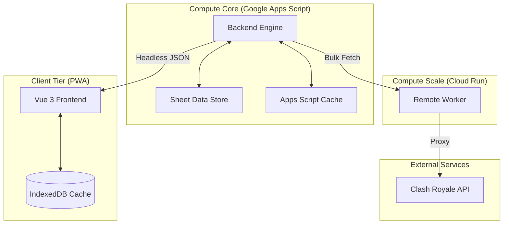

# System Architecture: Clash Manager

## Overview

Clash Manager is a sovereign intelligence engine for Clash Royale clan leadership. It operates as a distributed system composed of three primary tiers: a high-capacity ETL engine (Google Apps Script), a high-concurrency fetching proxy (Cloud Run), and a glassmorphic administrative interface (Vue 3 PWA).

## System Topology

## Component Breakdown

### 1. Backend Engine (Google Apps Script)
The "Brain" of the system. It handles the heavy-lift logic that requires stable, scheduled execution.
- **ETL Pipelines**: Aggregates member data, war performance, and donation history.
- **Scoring Engine**: Implements the multi-dimensional performance algorithm with exponential decay for inactivity.
- **Matrix Normalization**: Transports data in compressed matrices to minimize payload size and execution overhead.
- **Trigger Management**: Uses time-based triggers for hourly data synchronization.

### 2. Remote Worker (Cloud Run)
The "Muscle" of the system. It circumvents the limitations of the Google environment.
- **Concurrency**: Executes parallel HTTP requests to the Clash Royale API.
- **Quota Management**: Bypasses the `UrlFetchApp` daily quotas by using an external IP space.
- **Protocol**: Simple JSON-over-HTTP fetching protocol (`/fetch`).

### 3. Frontend Core (Vue 3 PWA)
The "Command Center". Designed for speed, offline resilience, and mobile-first administrative workflows.
- **State Management**: Uses lightweight reactive composables and IndexedDB for persistence.
- **Schema Validation**: Uses `valibot` for runtime type-checking and API response inflation.
- **UI Architecture**: Tailwind CSS based "Sovereign Design System" with glassmorphic elements and optimized list rendering.

## Data Protocols

### Headless API Handshake
The Backend (GAS) exposes a single `doGet` endpoint that serves as a Headless JSON API. The handshake involves:
1. **Action Routing**: The client requests a specific `action` (e.g., `getwebappdata`).
2. **Payload Delivery**: The server returns a unified matrix payload containing Leaderboard and Recruiter data.
3. **Double-Unwrap Protection**: The client handles the GAS redirection envelope to extract the inner JSON safely.

### Remote Worker Protocol
When the GAS engine requires high-volume scanning (e.g., scanning 1000+ tournament players):
1. **Dispatch**: GAS sends a batch of URLs to the Remote Worker.
2. **Execution**: The worker fetches the URLs in parallel using multiple API keys (Round-Robin).
3. **Aggregation**: The worker returns the results in a serialized array for GAS to process.

## Performance & Optimization

- **SWR (Stale-While-Revalidate)**: The frontend displays cached IndexedDB data immediately while fetching fresh data in the background.
- **v-memo Optimization**: List renders use conditional `v-memo` to ensure only expanded items react to background data updates, keeping UI interaction at 60fps.
- **Dynamic Imports**: Large libraries like `valibot` are imported dynamically to minimize the initial JS bundle size.

---

## License

Proprietary. © 2026 AlbiDR. All rights reserved.
